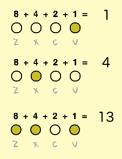

### Binary numbers

In this project you'll be using combinations of the four different keys to play different notes. You can think of each of the keys as either on (pressed) or off (not pressed). This means that you can think of each combination of keys as a __binary number__.

Moving from right to left the keys double in value, and are `1`, `2`, `4`, and `8`. By adding up the numbers above each key you can work out the value of the note.



There are 2<sup>4</sup> = __16 combinations__ that can be made with the four keys. This means that we can play 15 different notes, as `0` will mean that no note is played.

--- task ---
Create a new variable called `note`, and drag it next to the 4 note sprites.


[[[generic-scratch-add-variable]]]
--- /task ---


--- task ---
Add code to the Stage to use the keys pressed to calculate the value of the note to be played.

For example, when `c` and `v` are pressed, the value of `note` should be `3`.


--- hints ---
--- hint ---
When the `flag is clicked`{:class="blockevents"}, the `note`{:class="blockdata"} variable should be `set`{:class="blockdata"} to `0`{:class="blockdata"}.

+ `if`{:class="blockcontrol"} the `v key is pressed`{:class="blocksensing"}, the `note`{:class="blockdata"} should be `changed by 1`{:class="blockdata"}
+ `if`{:class="blockcontrol"} the `c key is pressed`{:class="blocksensing"}, the `note`{:class="blockdata"} should be `changed by 2`{:class="blockdata"}
+ `if`{:class="blockcontrol"} the `x key is pressed`{:class="blocksensing"}, the `note`{:class="blockdata"} should be `changed by 4`{:class="blockdata"}
+ `if`{:class="blockcontrol"} the `z key is pressed`{:class="blocksensing"}, the `note`{:class="blockdata"} should be `changed by 8`{:class="blockdata"}

All of this code should be repeated `forever`.{:class="blockcontrol"}
--- /hint ---
--- hint ---
Here are the code blocks you'll need (but you'll need more than one of some of the blocks):
```blocks
forever
end
if < > then
end
key [ v] pressed?

change [note v] by ( )

set [note v] to [ ]

when flag clicked
```
--- /hint ---
--- hint ---
This is what your code should look like:
```blocks
when flag clicked
forever
set [note v] to [0]
if <key [v v] pressed? > then
change [note v] by (1)
end
if <key [c v] pressed? > then
change [note v] by (2)
end
if <key [x v] pressed? > then
change [note v] by (4)
end
if <key [z v] pressed? > then
change [note v] by (8)
end
end
```
--- /hint ---
--- /hints ---
--- /task ---
