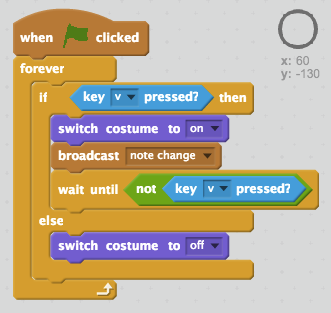

## Playing notes

Let's play notes when keys are pressed.

+ Broadcast a 'note change' message whenever `each of the four keys` is pressed.

+ Add code to the Stage to play a note when a combination of keys is pressed.

Your notes should start at middle C, which is note 60.

--- hints ---
--- hint ---
When your stage `receives` the 'change note' message, it should `stop all sounds` before `playing a note` based on the value of your `note` variabe.

+ When your `note` variable is `1`, note 60 should be played
+ When your `note` variable is `2`, note 61 should be played
+ When your `note` variable is `3`, note 62 should be played
+ etc...

--- /hint ---
--- hint ---
Here are the code blocks you'll need:

--- /hint ---
--- hint ---
This is what your code should look like:

--- /hint ---
--- /hints ---

+ Test your code. You'll notice that the note is repeatedly played when a key is held down.

<video width="400" controls>
  <source src="images/play-note-bug.mp4" type="video/mp4">
  Your browser does not support HTML5 video.
</video>

+ Can you add code so that the key sprites only play a note `once` when a key is held down?

--- hints ---
--- hint ---
When each of the `z`, `x`, `c` and `v` keys is pressed, your code should `wait until` the `key is not pressed` before continuing.
--- /hint ---
--- hint ---
Here are the code blocks you'll need:

--- /hint ---
--- hint ---
This is what your code should look like:

--- /hint ---
--- /hints ---
