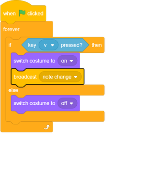
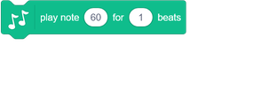
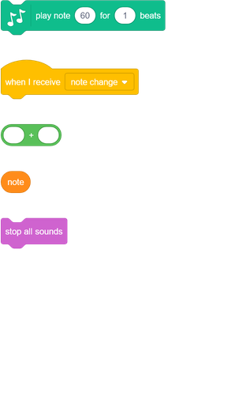
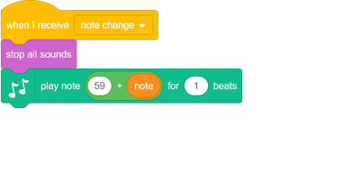
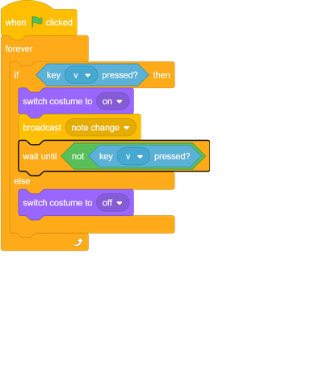

## Play notes

Play notes when the keys are pressed.

--- task ---

Add the Music extension to your project.

[[[generic-scratch3-add-music-extension]]]

--- /task ---

--- task ---
Broadcast a 'note change' message whenever **any of the four keys** is pressed.

--- /task ---

--- task ---
Add code to the Stage to play a note when a combination of keys is pressed.

Your notes should start at middle C, which is note 60.

--- hints ---
--- hint ---

When your stage `receives`{:class="block3events"} the 'change note' broadcast, it should `stop all sounds`{:class="block3sound"} before `playing a note`{:class="block3sound"} based on the value of the`note`{:class="block3variables"} variable.

+ When the `note`{:class="block3variables"} variable is `1`{:class="block3variables"}, note 60 should play
+ When the `note`{:class="block3variables"} variable is `2`{:class="block3variables"}, note 61 should play
+ When the `note`{:class="block3variables"} variable is `3`{:class="block3variables"}, note 62 should play
+ etc...

--- /hint ---
--- hint ---
Here are the code blocks you need:

--- /hint ---
--- hint ---
This is what your code should look like:

--- /hint ---
--- /hints ---
--- /task ---

--- task ---
Test your code. Can you hear that a note is repeatedly played when you hold down a key?

--- no-print ---
<video width="400" controls>
  <source src="images/play-note-bug.mp4" type="video/mp4">
  Your browser does not support HTML5 video.
</video>
--- /no-print ---

--- /task ---

--- task ---
Add code so that the **all** the key sprites only play a note **once** when a key is held down?

--- /task ---
