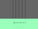

## Play notes

Play notes when the keys are pressed.

--- task ---

Add the Music extension to your project.

[[[generic-scratch3-add-music-extension]]]

--- /task ---

--- task ---

Broadcast a 'note change' message whenever **any of the four keys** is pressed.


```blocks3
when flag clicked
forever
if < key (v v) pressed?> then
switch costume to (on v)
+broadcast (note change v)
else
switch costume to (off v)
end
```

--- /task ---

--- task ---

Add code to the Stage to play a note when a combination of keys is pressed.

Your notes should start at middle C, which is note 60.

```blocks3
play note (60) for (1) beats
```

--- hints ---
--- hint ---

This is what your code should look like:



```blocks3
when I receive [note change v]
stop all sounds
play note ((59) + (note :: variables)) for (1) beats
```

--- /hint ---
--- /hints ---

--- /task ---

--- task ---

Test your code. Can you hear that a note is repeatedly played when you hold down a key?

--- no-print ---

<video width="400" controls>
  <source src="images/play-note-bug.mp4" type="video/mp4">
  Your browser does not support HTML5 video.
</video>

--- /no-print ---

--- /task ---

--- task ---

Add code so that the **all** the key sprites only play a note **once** when a key is held down.


```blocks3
when flag clicked
forever
if < key (v v) pressed?> then
switch costume to (on v)
broadcast (note change v)
+wait until <not <key (v v) pressed?>
else
switch costume to (off v)
end
```

--- /task ---
