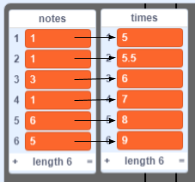

## Scrolling notes

Scroll notes down the stage so that the player knows which keys to press.

+ Create 2 lists.

+ Add 5 notes to lists/notes

+ Explain lists

+ Code to create a clone 2 seconds before needed

--- hints ---
--- hint ---
...
--- /hint ---
--- hint ---
Here are the code blocks you'll need:

--- /hint ---
--- hint ---
This is what your code should look like:

--- /hint ---
--- /hints ---

+ Code to make a clone scroll.

--- hints ---
--- hint ---
...
--- /hint ---
--- hint ---
Here are the code blocks you'll need:

--- /hint ---
--- hint ---
This is what your code should look like:

--- /hint ---
--- /hints ---
