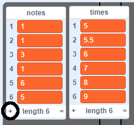
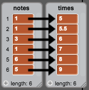
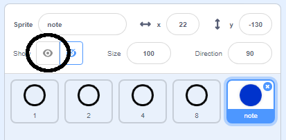
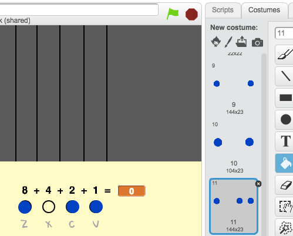
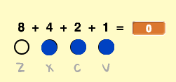

## Scrolling notes

You need to make notes scroll down the Stage so that the player knows which keys to press and when to press them.

--- task ---

Create two lists called `notes`{:class="block3variables"} and `times`{:class="block3variables"}.

[[[generic-scratch3-make-list]]]

--- /task ---

--- task ---

Add the following numbers to your `notes`{:class="block3variables"} and `times`{:class="block3variables"} lists. Note: make sure to **add these exact numbers in the right order**.



--- /task ---

Here's how songs are stored in your game:

+ The `notes`{:class="block3variables"} list stores the notes of the song (from 1 to 15), in order
+ The `times`{:class="block3variables"} list stores the times when the notes should be played in the song



So with the two new lists:

+ Note 1 (middle C) should be played at 5 seconds
+ Note 1 should be played again at 5.5 seconds
+ Note 3 should be played at 6 seconds
+ etc...

--- task ---

Click on the 'note' sprite and then click on **show**.



Then click on **Costumes**.



--- /task ---

You should see that the 'note' sprite has 15 different costume, one for each different note from 1 to 15.

--- task ---

Add code to create a 'note' sprite clone for every note stored in `notes`{:class="block3variables"}. Each clone should be created at the correct time stored in `times`{:class="block3variables"}. Each clone should be created two seconds before its note needs to be played. This gives the clone two seconds to move down the screen. You'll create the code to move your clones in a little bit!



--- hints ---
--- hint ---

This is what your code should look like:


```blocks3
when flag clicked
reset timer
hide
repeat until <(length of [notes v]) = [0]>
wait until <(timer) > ((item (1 v) of [times v]) - (2))>
switch costume to (item (1 v) of [notes v])
create clone of (myself v)
delete (1 v) of [times v]
delete (1 v) of [notes v]
end
```

--- /hint ---
--- /hints ---

--- /task ---

When you test your code now, nothing seems to happen, because the 'note' sprite is hidden. If you show (or don't hide) the sprite, then you should see clones being created on top of each other.

--- task ---

Add code to make each 'note' clone glide from the top to the bottom of the Stage before being deleted.


```blocks3
when I start as a clone
go to x: (20) y: (160)
show
glide (2) secs to x: (20) y:(-130)
delete this clone
```

--- /task ---
