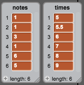

## Storing songs

You've made it so that notes are removed from the lists once they've been played, so you'll be left with empty lists:


You're now going to add code to store songs in your project, so that you don't have to add to your lists each time.



--- task ---
Make a block called `load 'happy birthday'`{:class="blockmoreblocks"} that clears both the `notes`{:class="blockdata"} and `times`{:class="blockdata"} lists, and then adds the numbers back into both lists.
[[[generic-scratch-make-block]]]
--- hints ---
--- hint ---
When your new block is run, `all items`{:class="blockdata"} should be deleted from both the `notes`{:class="blockdata"} and `times`{:class="blockdata"} lists. Each of the five numbers should then be `added`{:class="blockdata"} to both lists.
--- /hint ---
--- hint ---
Here are the code blocks you'll need:

```blocks
delete (all v) of [notes v]

define load 'happy birthday'

add [1] to [notes v]

delete (all v) of [times v]
```
--- /hint ---
--- hint ---
This is what your code should look like:

```blocks
define load 'happy birthday'
delete (all v) of [notes v]
delete (all v) of [times v]
add [1] to [notes v]
add [5] to [notes v]
add [1] to [notes v]
add [5.5] to [notes v]
add [3] to [notes v]
add [6] to [notes v]
add [1] to [notes v]
add [7] to [notes v]
add [6] to [notes v]
add [8] to [notes v]
add [5] to [notes v]
add [9] to [notes v]
```
--- /hint ---
--- /hints ---
--- /task ---


--- task ---
Test your new block by running it at the start of your project.

```blocks
when flag clicked
+load 'happy birthday' ::custom
hide
reset timer
```

Each of your lists should now contain five numbers.


--- /task ---
