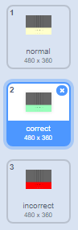

## Keeping score

Improve your game by giving the player points each time the correct note is played.

+ Create a new variable called `score`, and place it at the top of your stage.

+ Add to the player's score whenever they play the correct note at the correct time. Remember to set their score to `0` at the start of the game.

--- hints ---
--- hint ---
`Before each clone is deleted`, it should check to see `if` the `note` is `equal to` the `costume number`. If they are the same, the score can be `changed`.
--- /hint ---
--- hint ---
Here are the code blocks you'll need:

--- /hint ---
--- hint ---
This is what your code should look like:

--- /hint ---
--- /hints ---

+ Broadcast a message called 'correct' when the correct note is played.

+ Add code to your Stage to briefly change how it looks when the player plays the correct note. A costume has been provided for you.

--- hints ---
--- hint ---
When your stage receives the 'correct' message, it should `switch costume`, `wait` for a short time before `switching back`.

You might also need to add code to `set the costume` to normal when the `flag is clicked`.
--- /hint ---
--- hint ---
Here are the code blocks you'll need:

--- /hint ---
--- hint ---
This is what your code should look like:

--- /hint ---
--- /hints ---
