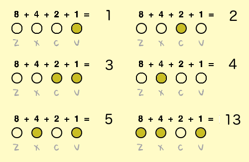
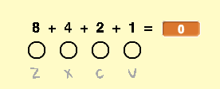
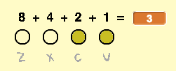

## Números binarios

You will use different combinations of pressing the four keys to play different notes. Cada una de las teclas está encendida (presionada) o apagada (no presionada). Esto significa que puedes pensar en cada combinación de teclas como un **número binario**.

De derecha a izquierda las teclas duplican su valor: `1`, `2`, `4`, y `8`. Al sumar los números que están sobre las teclas que se presionan, puedes calcular el valor de la nota.



There are 2<sup>4</sup> = **16 combinations** of pressing the four keys. Esto significa que puedes tocar 15 notas diferentes y el `0` significará que no se reproduce ninguna nota.

\--- task \---

Create a new variable called `note`{:class="block3variables"}, and drag it next to the four note sprites.



[[[generic-scratch3-add-variable]]]

\--- /task \---

`nota`{:class="block3variables"} almacenará el valor de la nota que se debe reproducir.

\--- task \---

Add code to the Stage to use the combination of pressed keys to calculate the value of `note`{:class="block3variables"}.

For example, when `c` and `v` are pressed, the value of `note`{:class="block3variables"} should be `3`.



\--- hints \--- \--- hint \---


When the `flag is clicked`{:class="block3events"}, the `note`{:class="block3variables"} variable should be `set`{:class="block3variables"} to `0`{:class="block3variables"}.

+ `if`{:class="block3control"} the `v key is pressed`{:class="block3sensing"}, the `note`{:class="block3variables"} should be `changed by 1`{:class="block3variables"}
+ `if`{:class="block3control"} the `c key is pressed`{:class="block3sensing"}, the `note`{:class="block3variables"} should be `changed by 2`{:class="block3variables"}
+ `if`{:class="block3control"} the `x key is pressed`{:class="block3sensing"}, the `note`{:class="block3variables"} should be `changed by 4`{:class="block3variables"}
+ `if`{:class="block3control"} the `z key is pressed`{:class="block3sensing"}, the `note`{:class="block3variables"} should be `changed by 8`{:class="block3variables"}

All of this code should be repeated `forever`{:class="block3control"}.

\--- /hint \--- \--- hint \---

Here are the code blocks you need, and you have to add some of them more than once:


```blocks3
forever
end
if < > then
end
key ( v) pressed?

change [note v] by ( )

set [note v] to [ ]

when flag clicked
```

\--- /hint \--- \--- hint \---

Así es como debería verse tu código:


```blocks3
when flag clicked
forever
set [note v] to [0]
if <key (v v) pressed? > then
change [note v] by (1)
end
if <key (c v) pressed? > then
change [note v] by (2)
end
if <key (x v) pressed? > then
change [note v] by (4)
end
if <key (z v) pressed? > then
change [note v] by (8)
end
end
```

\--- /hint \--- \--- /hints \--- \--- /task \---