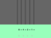

## Reproducir notas

Reproducir notas cuando se presionan las teclas.

\--- task \---

Añade la extensión de Música a tu proyecto.

[[[generic-scratch3-add-music-extension]]]

\--- /task \---

\--- task \---

Broadcast a 'note change' message whenever **any of the four keys** is pressed.


```blocks3
when flag clicked
forever
if < key (v v) pressed?> then
switch costume to (on v)
+broadcast (note change v)
else
switch costume to (off v)
end
```

\--- /task \---

\--- task \---

Añade código al Escenario para reproducir una nota cuando se presiona una combinación de teclas.

Las notas deben comenzar en Do central, que es la nota 60.

```blocks3
play note (60) for (1) beats
```

\--- hints \--- \--- hint \---



When your stage `receives`{:class="block3events"} the 'change note' broadcast, it should `stop all sounds`{:class="block3sound"} before `playing a note`{:class="block3sound"} based on the value of the`note`{:class="block3variables"} variable.

+ Cuando la variable `nota`{:class="block3variables"} es `1`{:class="block3variables"}, la nota 60 debe reproducirse
+ Cuando la variable `nota`{:class="block3variables"} es `2`{:class="block3variables"}, la nota 61 debe reproducirse
+ Cuando la variable `nota`{:class="block3variables"} es `3`{:class="block3variables"}, la nota 62 debe reproducirse
+ etc...

\--- /hint \--- \--- hint \---

Aquí están los bloques de código que necesitas:


```blocks3
play note (60) for (1) beats
when I receive [note change v]
() + ()
(note)
stop all sounds
```

\--- /hint \--- \--- hint \---

Así es como debería verse tu código:


```blocks3
when I receive [note change v]
stop all sounds
play note ((59) + (note :: variables)) for (1) beats
```

\--- /hint \--- \--- /hints \--- \--- /task \---

\--- task \---

Prueba tu código. Can you hear that a note is repeatedly played when you hold down a key?

\--- no-print \---

<video width="400" controls>
  <source src="images/play-note-bug.mp4" type="video/mp4">
  Your browser does not support HTML5 video.
</video>

\--- /no-print \---

\--- /task \---

\--- task \---

Add code so that the **all** the key sprites only play a note **once** when a key is held down?


```blocks3
when flag clicked
forever
if < key (v v) pressed?> then
switch costume to (on v)
broadcast (note change v)
+wait until <not <key (v v) pressed?>
else
switch costume to (off v)
end
```

\--- /task \---