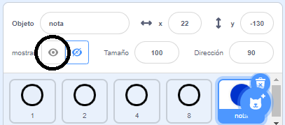
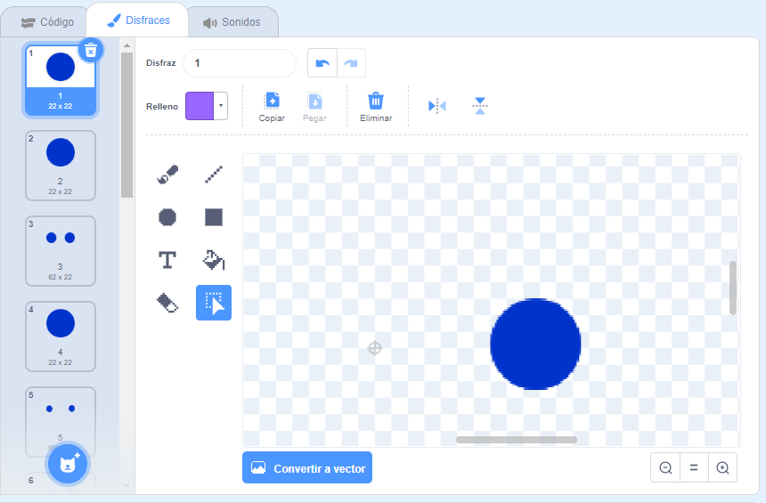
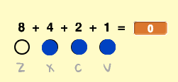

## Scrolling notes

You need to make notes scroll down the Stage so that the player knows which keys to press and when to press them.

\--- task \---

Crea dos listas llamadas `notas`{:class="block3variables"} y `tiempos`{:class="block3variables"}.

[[[generic-scratch3-make-list]]]

\--- /task \---

\--- task \---

Agrega los siguientes números a tus listas `notas`{:class="block3variables"} y `tiempos`{:class="block3variables"}. Note: make sure to **add these exact numbers in the right order**.


\--- /task \---

Así es como se almacenan las canciones en tu juego:

+ La lista `notas`{:class="block3variables"} guarda las notas de la canción, en orden del 1 al 15.
+ La lista `tiempos`{:class="block3variables"} almacena las veces en que las notas se deben reproducir en la canción.


Así que con las dos nuevas listas:

+ Note 1 (middle C) should be played at 5 seconds
+ Note 1 should be played again at 5.5 seconds
+ Note 3 should be played at 6 seconds
+ etc...

\--- task \---

Haz clic en el objeto «notas» y luego haz clic en **mostrar**.



Luego haz clic en **Disfraces**.



\--- /task \---

You should see that the 'note' sprite has 15 different costume, one for each different note from 1 to 15.

\--- task \---

Add code to create a 'note' sprite clone for every note stored in `notes`{:class="block3variables"}. Cada clon se debe crear en el tiempo correcto el cual fue almacenado en `tiempos`{:class="block3variables"}. Cada clon se debe formar dos segundos antes de que se reproduzca la nota. Esto le da al clon dos segundos para moverse hacia abajo en la pantalla. You'll create the code to move your clones in a little bit!



\--- hints \--- \--- hint \---

 When the `flag is clicked`{:class="block3events"}, the 'note' sprite should `hide`{:class="block3looks"}, and the `timer`{:class="block3variables"} should be `reset`{:class="block3variables"}.

The script should then `wait until`{:class="block3control"} the value of `timer`{:class="block3variables"} is `greater than`{:class="block3operators"} the next note to be played, which will be the `time`{:class="block3variables"} at the `start of the list`{:class="block3variables"} (`minus 2 seconds`{:class="block3operators"}).

The costume for the 'note' sprite should then be set to the next `note`{:class="block3variables"} to be played (the `note`{:class="block3variables"} at the start of the list), before a `clone`{:class="block3events"} of the 'note' sprite is created.

The items at the start of the `notes`{:class="block3variables"} and `times`{:class="block3variables"} lists should then be `deleted`{:class="block3variables"}, and the entire process should be `repeated until`{:class="block3control"} there are no items left in the `notes`{:class="block3variables"} list.

\--- /hint \--- \--- hint \---

Aquí están los bloques de código que necesitas:


```blocks3
wait until <>
when flag clicked
length of [notes v]

create clone of (myself v)

reset timer
item (1 v) of [times v]
hide

repeat until <>
end
[] > []
item (1 v) of [notes v]
() - ()
switch costume to ( v)
[] = []
timer
delete (1 v) of [times v]

delete (1 v) of [notes v]
```

\--- /hint \--- \--- hint \---

Así es como debería verse tu código:


```blocks3
when flag clicked
reset timer
hide
repeat until <(length of [notes v]) = [0]>
wait until <(timer) > ((item (1 v) of [times v]) - (2))>
switch costume to (item (1 v) of [notes v])
create clone of (myself v)
delete (1 v) of [times v]
delete (1 v) of [notes v]
end
```

\--- /hint \--- \--- /hints \--- \--- /task \---

When you test your code now, nothing seems to happen, because the 'note' sprite is hidden. Si muestras (o no ocultas) el objeto, entonces deberías ver que los clones se están creando unos sobre otros.

\--- task \---

Añade código para hacer que cada clon «nota» se deslice desde arriba hacia abajo del escenario antes de que se elimine.


```blocks3
when I start as a clone
go to x: (20) y: (160)
show
glide (2) secs to x: (20) y:(-130)
delete this clone
```

\--- /task \---