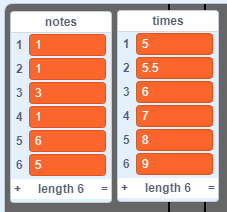

## Guarda tu canción

Hasta el momento, las notas se eliminan desde las listas después de ser reproducidas, así que quedas con listas vacías:


Ahora vas a agregar código para guardar las canciones en tu proyecto, para que solo tengas que agregarlas una vez a tus listas.


\--- task \---

Make a new block called `load 'happy birthday'`{:class="block3myblocks"} that clears both the `notes`{:class="block3variables"} and `times`{:class="block3variables"} lists, and then adds the correct numbers back into both lists.

[[[generic-scratch3-make-block]]]

\--- hints \--- \--- hint \---

The `load 'happy birthday'`{:class="block3myblocks"} block should `delete all`{:class="block3variables"} items from both the `notes`{:class="block3variables"} and `times`{:class="block3variables"} lists and then `add`{:class="block3variables"} the correct six numbers to the list they belong in, in the correct order.

\--- /hint \--- \--- hint \---

Here are the code blocks you need:


```blocks3
delete all of [notes v]

define load 'happy birthday'

add [1] to [notes v]

delete all of [times v]
```

\--- /hint \--- \--- hint \---

This is what your code should look like:


```blocks3
define load 'happy birthday'
delete all of [notes v]
delete all of [times v]
add [1] to [notes v]
add [5] to [times v]
add [1] to [notes v]
add [5.5] to [times v]
add [3] to [notes v]
add [6] to [times v]
add [1] to [notes v]
add [7] to [times v]
add [6] to [notes v]
add [8] to [times v]
add [5] to [notes v]
add [9] to [times v]
```

\--- /hint \--- \--- /hints \--- \--- /task \---

\--- task \---

Test your new block by running it at the start of your project.


```blocks3
when flag clicked
+load 'happy birthday' ::custom
hide
reset timer
```

Each of your lists should now contain six numbers.



\--- /task \---