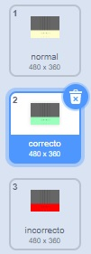

## Keep a score

Improve your game by giving the player points for playing the correct note.

\--- task \---

Crea una nueva variable llamada `puntaje`{:class="block3variables"}, y colócala en la parte superior de tu escenario.


\--- /task \---

\--- task \---

Add to `score`{:class="block3variables"} whenever the player plays the correct note at the correct time. Remember to set `score`{:class="block3variables"} to `0`{:class="block3variables"} at the start of the game.

\--- hints \--- \--- hint \---

`Before each clone is deleted`{:class="block3control"}, it should check to see `if`{:class="block3control"} the `note`{:class="block3variables"} is `equal to`{:class="block3operators"} the `costume number`{:class="block3looks"}, and in that case, the score should be `changed`{:class="block3variables"}.

\--- /hint \--- \--- hint \---

Aquí están los bloques de código que necesitas:


```blocks3
[ ] = [ ]
(costume [number v])
(note)
change [score v] by (1)

if <> then
else
end
```

\--- /hint \--- \--- hint \---

Así es como debería verse tu código:


```blocks3
when I start as a clone
go to x: (20) y: (160)
show
glide (2) secs to x: (20) y:(-130)
+if <(note :: variables) = (costume [number v])> then
change [score v] by (1)
end
delete this clone
```

\--- /hint \--- \--- /hints \--- \--- /task \---

\--- task \---

Broadcast a message called 'correct' when the correct note is played.


```blocks3
when I start as a clone
go to x: (20) y: (160)
show
glide (2) secs to x: (20) y:(-130)
if <(note :: variables) = (costume [number v])> then
change [score v] by (1)
+broadcast (correct v)
end
delete this clone
```

\--- /task \---

\--- task \---



Add code to your Stage to briefly change the backdrop when the player plays the correct note. El proyecto ya contiene un segundo telón de fondo para esto.


```blocks3
when flag clicked
switch backdrop to (normal v)

when I receive [correct v]
switch backdrop to (correct v)
wait (0.3) seconds
switch backdrop to (normal v)
```

\--- /task \---