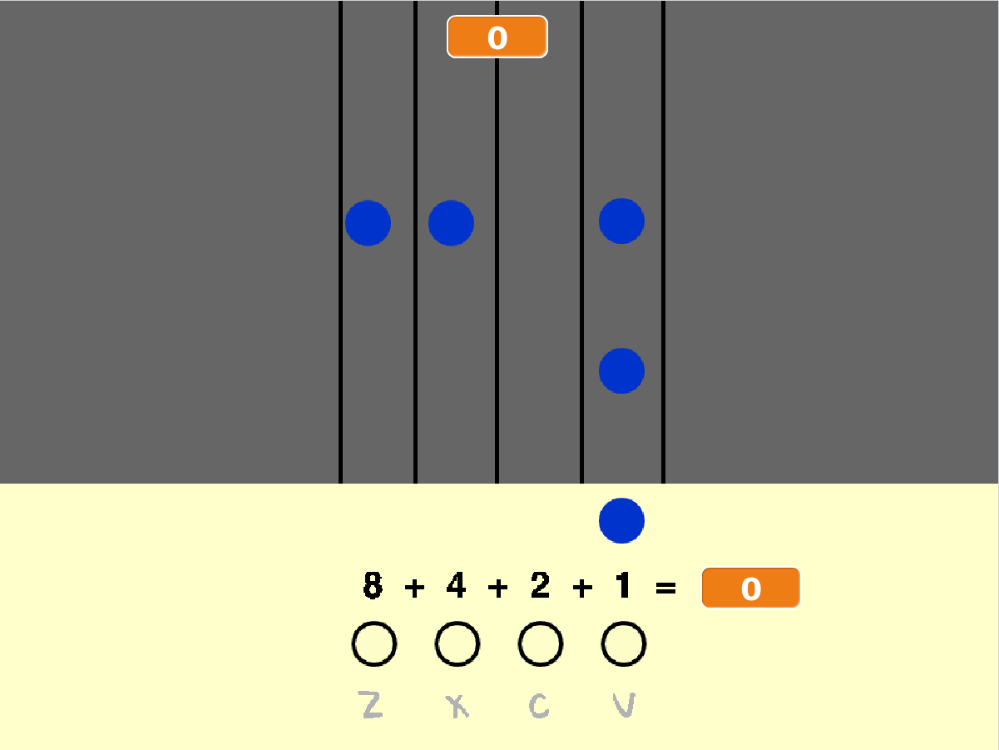

--- no-print ---

Ceci est la version **Scratch 3** du projet. Il existe également une version [Scratch 2 du projet](https://projects.raspberrypi.org/fr-FR/projects/binary-hero-scratch2).

--- /no-print ---

## Introduction

Dans ce projet, tu vas créer un jeu dans lequel tu joues les notes d'une chanson pendant qu'elles défilent sur la scène.

### Ce que tu feras

--- no-print ---

Clique sur le drapeau vert pour commencer la partie. Utilise les touches <kbd>z</kbd>, <kbd>x</kbd>, <kbd>c</kbd>, et <kbd>v</kbd> pour jouer les bonnes notes lorsque celles-ci atteignent le bas de la scène. Tu marqueras dix points pour chaque note que tu joueras.

  <iframe allowtransparency="true" width="485" height="402" src="https://scratch.mit.edu/projects/embed/259028053/?autostart=false" frameborder="0" scrolling="no"></iframe>

--- /no-print ---

--- print-only ---

Les notes tomberont d'en haut, et tu devras appuyer sur des touches pour les « attraper » et les jouer.

--- /print-only ---

--- collapse ---
---
title: Ce que tu vas apprendre
---

+ Comment utiliser des listes pour stocker des séquences de notes et de temps
+ Comment utiliser des blocs personnalisés avec des entrées

--- /collapse ---

--- collapse ---
---
title: Ce dont tu auras besoin
---

### Matériel informatique

+ Un ordinateur capable d'exécuter Scratch 3

### Logiciel

+ Scratch 3 (soit [en ligne](http://rpf.io/scratchon){:target="_blank"} ou [hors ligne](http://rpf.io/scratchoff){:target="_blank"})

### Téléchargements

+ [Projet de démarrage hors connexion](http://rpf.io/p/fr-FR/binary-hero-go){:target="_blank"}

--- /collapse ---

--- collapse ---
---
title: Notes supplémentaires pour les éducateurs
---

--- no-print ---

Si vous avez besoin d'imprimer ce projet, merci d'utiliser la [version imprimable](https://projects.raspberrypi.org/fr-FR/projects/binary-hero/print).

--- /no-print ---

Vous pouvez trouver le [projet terminé ici](http://rpf.io/p/fr-FR/binary-hero-get){:target="_blank"}.

--- /collapse ---