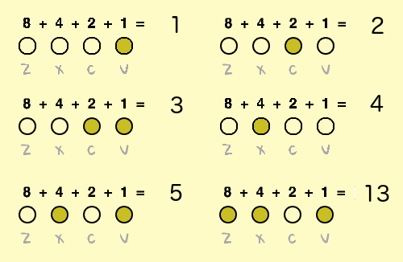
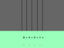

## Nombres binaires

Tu utiliseras différentes combinaisons d'appui sur les quatre touches pour jouer différentes notes. Chacune des touches est allumée (enfoncée) ou éteinte (non enfoncée). Cela signifie que tu peux considérer chaque combinaison de touches comme un **nombre binaire**.

En se déplaçant de droite à gauche, la valeur des touches double : `1`, `2`, `4` et `8`. En ajoutant les nombres au-dessus des touches pressées, tu peux calculer la valeur de la note.



Il y a 2<sup>4</sup> = **16 combinaisons** d'appui sur les quatre touches. Cela signifie que tu peux jouer 15 notes différentes, car `0` signifie qu'aucune note n'est jouée.

--- task ---

Crée une nouvelle variable appelée `note`{:class="block3variables"}, et fais-la glisser à côté des quatre sprites de notes.


[[[generic-scratch3-add-variable]]]

--- /task ---

`note`{:class="block3variables"} stockera la valeur de la note à jouer.

--- task ---

Ajoute du code à la scène pour utiliser la combinaison de touches pressées pour calculer la valeur de la `note`{:class="block3variables"}.

Par exemple, lorsque les touches `c` et `v` sont pressées, la valeur de `note`{:class="block3variables"} doit être `3`.


--- hints ---
 --- hint ---



Quand le `drapeau vert est cliqué`{:class="block3events"}, la variable `note`{:class="block3variables"} doit être `définie`{:class="block3variables"} à `0`{:class="block3variables"}.

+ `si`{:class="block3control"} la `touche v est pressée`{:class="block3sensing"}, la `note`{:class="block3variables"} doit être `modifiée par 1`{:class="block3variables"}
+ `si`{:class="block3control"} la `touche c est pressée`{:class="block3sensing"}, la `note`{:class="block3variables"} doit être `modifiée par 2`{:class="block3variables"}
+ `si`{:class="block3control"} la `touche x est pressée`{:class="block3sensing"}, la `note`{:class="block3variables"} doit être `modifiée par 4`{:class="block3variables"}
+ `si`{:class="block3control"} la `touche z est pressée`{:class="block3sensing"}, la `note`{:class="block3variables"} doit être `modifiée par 8`{:class="block3variables"}

Tout ce code doit être répété `indéfiniment`{:class="block3control"}.

--- /hint --- --- hint ---

Voici les blocs de code dont tu as besoin, et tu devras ajouter certains d'entre eux plus d'une fois :


```blocks3
forever
end
if < > then
end
key ( v) pressed?

change [note v] by ( )

set [note v] to [ ]

when flag clicked
```

--- /hint --- --- hint ---

Voici à quoi ton code devrait ressembler :


```blocks3
when flag clicked
forever
set [note v] to [0]
if <key (v v) pressed? > then
change [note v] by (1)
end
if <key (c v) pressed? > then
change [note v] by (2)
end
if <key (x v) pressed? > then
change [note v] by (4)
end
if <key (z v) pressed? > then
change [note v] by (8)
end
end
```

--- /hint ------ /hints --- --- /task ---