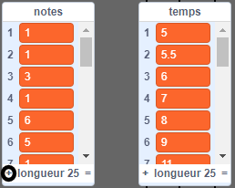
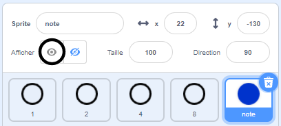
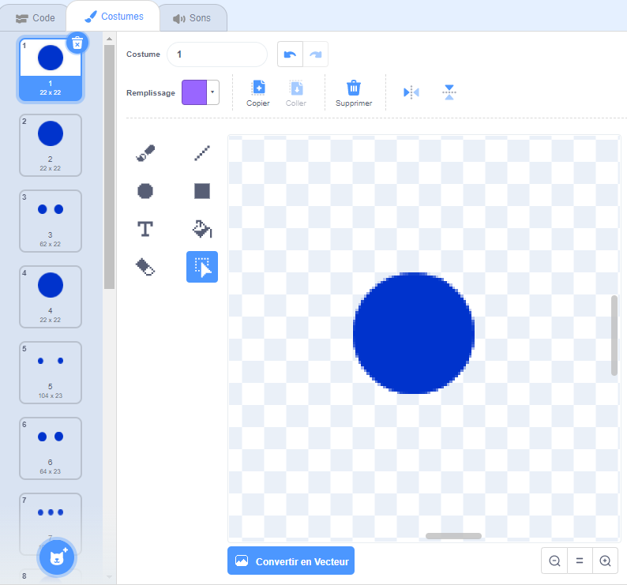

## Notes qui défilent

Tu dois faire défiler les notes vers le bas pour que le joueur sache quelles touches appuyer et quand les appuyer.

--- task ---

Crée deux listes appelées `notes`{:class="block3variables"} et `temps`{:class="block3variables"}.

[[[generic-scratch3-make-list]]]

--- /task ---

--- task ---

Ajoute les nombres suivants à tes listes `notes`{:class="block3variables"} et `temps`{:class="block3variables"}. Remarque : assure-toi d' **ajouter ces nombres exacts dans le bon ordre**.



--- /task ---

Voici comment les chansons sont stockées dans ton jeu :

+ La liste des `notes`{:class="block3variables"} stocke les notes de la chanson (de 1 à 15), dans l'ordre
+ La liste `temps`{:class="block3variables"} stocke les temps où les notes doivent être jouées dans la chanson


Donc, avec les deux nouvelles listes :

+ La note 1 (C moyen) doit être jouée à 5 secondes
+ La note 1 devrait être jouée à nouveau à 5,5 secondes
+ La note 3 doit être jouée à 6 secondes
+ etc...

--- task ---

Clique sur le sprite « note » puis clique sur **montrer**.



Puis clique sur **Costumes**.



--- /task ---

Tu devrais voir que le sprite « note » a 15 costumes différents, un pour chaque note différente de 1 à 15.

--- task ---

Ajoute du code pour créer un clone du sprite « note » pour chaque note stockée dans `notes`{:class="block3variables"}. Chaque clone doit être créé au temps correct stocké dans `temps`{:class="block3variables"}. Chaque clone doit être créé deux secondes avant que sa note ne soit jouée. Cela donne au clone deux secondes pour descendre l'écran. Tu vas créer le code pour déplacer un peu tes clones !


--- hints ---
 --- hint ---

 Quand le `drapeau vert est cliqué`{:class="block3events"}, le sprite « note » devrait `cacher`{:class="block3looks"}, et le `chronomètre`{:class="block3variables"} devrait être `réinitialisé`{:class="block3variables"}.

Le script devrait alors `attendre jusqu'à ce que`{:class="block3control"} la valeur du `chronomètre`{:class="block3variables"} soit `plus grande que`{:class="block3operators"} la note suivante à jouer, qui sera le `temps`{:class="block3variables"} au `début de la liste`{:class="block3variables"} (`moins 2 secondes`{:class="block3operators"}).

Le costume du sprite « note » devrait alors être défini sur la note `suivante`{:class="block3variables"} à jouer (la `note`{:class="block3variables"} au début de la liste), avant qu'un `clone`{:class="block3events"} du sprite « note » soit créé.

Les éléments au début des `notes`{:class="block3variables"} et les listes `temps`{:class="block3variables"} doivent ensuite être `supprimées`{:class="block3variables"}, et tout le processus devrait être `répété jusqu'à ce qu'`{:class="block3control"} il n'y a plus aucun élément dans la liste `notes`{:class="block3variables"}.

--- /hint --- --- hint ---

Voici les blocs de code dont tu as besoin :


```blocks3
wait until <>
when flag clicked
length of [notes v]

create clone of (myself v)

reset timer
item (1 v) of [temps v]
hide

repeat until <>
end
[] > []
item (1 v) of [notes v]
() - ()
switch costume to ( v)
[] = []
timer
delete (1 v) of [temps v]

delete (1 v) of [notes v]
```

--- /hint --- --- hint ---

Voici à quoi ton code devrait ressembler :


```blocks3
when flag clicked
reset timer
hide
repeat until <(length of [notes v]) = [0]>
wait until <(timer) > ((item (1 v) of [temps v]) - (2))>
switch costume to (item (1 v) of [notes v])
create clone of (myself v)
delete (1 v) of [temps v]
delete (1 v) of [notes v]
end
```

--- /hint ------ /hints --- --- /task ---

Lorsque tu testes ton code maintenant, rien ne semble se produire, car le sprite « note » est caché. Si tu montres (ou ne caches pas) le sprite, tu devrais voir des clones créés les uns sur les autres.

--- task ---

Ajoute du code pour que chaque clone « note » glisse du haut vers le bas de la scène avant d'être supprimé.


```blocks3
when I start as a clone
go to x: (20) y: (160)
show
glide (2) secs to x: (20) y:(-130)
delete this clone
```

--- /task ---