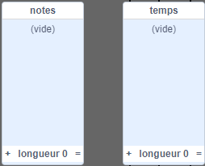

## Stocker ta chanson

Pour le moment, les notes sont supprimées des listes après avoir été jouées, donc tu te retrouves avec des listes vides :



Tu vas maintenant ajouter du code pour stocker des chansons dans ton projet, afin de ne pas avoir à les ajouter à tes listes à chaque fois.


--- task ---

Fais un nouveau bloc appelé `charger "joyeux anniversaire"`{:class="block3myblocks"} qui efface les listes de `notes`{:class="block3variables"} et `temps`{:class="block3variables"}, puis ajoute les bons nombres dans les deux listes. [[[generic-scratch3-make-block]]]

--- hints ---
 --- hint ---

Le bloc `charger "joyeux anniversaire"`{:class="block3myblocks"} devrait `supprimer tous les éléments`{:class="block3variables"} à la fois des `notes`{:class="block3variables"} et `temps`{:class="block3variables"} puis `ajouter`{:class="block3variables"} les six nombres corrects dans la liste dans laquelle ils appartiennent, dans l'ordre correct.

--- /hint --- --- hint ---

Voici les blocs de code dont tu as besoin :


```blocks3
delete (all v) of [notes v]

define charger "joyeux anniversaire"

add [1] to [notes v]

delete (all v) of [temps v]
```

--- /hint --- --- hint ---

Voici à quoi ton code devrait ressembler :


```blocks3
define charger "joyeux anniversaire"
delete (all v) of [notes v]
delete (all v) of [temps v]
add [1] to [notes v]
add [5] to [temps v]
add [1] to [notes v]
add [5.5] to [temps v]
add [3] to [notes v]
add [6] to [temps v]
add [1] to [notes v]
add [7] to [temps v]
add [6] to [notes v]
add [8] to [temps v]
add [5] to [notes v]
add [9] to [temps v]
```

--- /hint ------ /hints --- --- /task ---

--- task ---

Teste ton nouveau bloc en l'exécutant au début de ton projet.


```blocks3
when flag clicked
+charger "joyeux anniversaire" ::custom
hide
reset timer
```

Chacune de tes listes devrait maintenant contenir six nombres.


--- /task ---