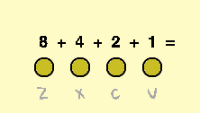

## कुंजी दबाना

आप चार कुंजियों के साथ कितनी धुनें बजा सकते हैं? आप जो सोचते हैं यह उससे अधिक हो सकता है!

\--- task \--- 'बाइनरी हीरो!' Scratch स्टार्टर प्रोजेक्ट खोलें।

**ऑनलाइन:** [rpf.io/binary-hero-on](http://rpf.io/binary-hero-on){:target="_blank"} पर स्टार्टर प्रोजेक्ट खोलें। यदि आपके पास Scratch खाता है, तो आप प्रोजेक्ट की प्रति सहेजने के लिए ऊपर दाएँ कोने पर **Remix** पर क्लिक कर सकते हैं।

**ऑफ़लाइन:** ऑफ़लाइन संपादक में [starter project](http://rpf.io/p/en/binary-hero-go){:target="_blank"} खोलें। यदि आपको स्क्रैच ऑफ़लाइन संपादक को डाउनलोड और इंस्टॉल करने की आवश्यकता है, तो आप इसे [rpf.io/scratchoff](http://rpf.io/scratchoff){:target="_blank"} पर पा सकते हैं। \--- /task \---

यह दिखाकर शुरू करें कि किस कुंजी को दबाया जा रहा है।

\--- task \--- '1' नामक स्प्राइट पर क्लिक करें, और यदि `v` कुंजी को दबाया गया हो तो स्प्राइट के परिधान को बदलने के लिए कोड जोड़ें।


```blocks3
when flag clicked
forever
if < key (v v) pressed?> then
switch costume to (on v)
else
switch costume to (off v)
end
```

जब आप <kbd>v</kbd> कुंजी को दबाकर अपने कोड का परीक्षण करते हैं, तो स्प्राइट में रोशनी होनी चाहिए।

 \--- /task \---

\--- task \--- अन्य तीन स्प्राइटों के लिए भी ऐसा ही करें ताकि यदि <kbd>z</kbd>, <kbd>x</kbd>, या <kbd>c</kbd> कुंजियों को दबाया जाता है तो स्प्राइटों में रोशनी होती है।

 \--- /task \---