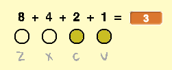

## बाइनरी संख्याएँ

आप विभिन्न स्वरों को बजाने के लिए चार कुंजियों को दबाने वाले विभिन्न संयोजनों का उपयोग करेंगे। प्रत्येक कुंजी या तो ऑन (दबाई गई) होती है या ऑफ (न दबाई गई) होती है। इसका मतलब है कि आप कुंजियों के प्रत्येक संयोजन को **binary number** (बाइनरी संख्या) के रूप में सोच सकते हैं।

दाएँ से बाएँ ओर चलते हुए कुंजियों का मूल्य दुगुना होता चला जाता है: `1`, `2`, `4`, और `8`। दबाई गई कुंजियों के ऊपर की संख्याओं को जोड़कर, आप स्वर के मान का पता लगा सकते हैं।


चारों कुंजियों को दबाने के 2<sup>4</sup> = **16 combinations** (संयोजन) हैं। इसका मतलब है कि आप 15 अलग-अलग स्वर बजा सकते हैं, क्योंकि `0` का मतलब होगा कि कोई स्वर नहीं बजता है।

\--- task \--- `note`{:class="block3variables"} नामक एक नया वेरिएबल बनाएँ, और इसे ड्रैग करके चार स्वर वाले स्प्राइट के बगल में ले जाएँ।


[[[generic-scratch3-add-variable]]]

\--- /task \---

`note`{:class="block3variables"} उस स्वर के मान को संगृहीत करेगा जिसे बजाया जाना चाहिए।

\--- task \--- `note`{:class="block3variables"} के मान की गणना करने के लिए दबाई गई कुंजियों के संयोजन का उपयोग करने के लिए स्टेज में कोड जोड़ें।

उदाहरण के लिए, जब `c` और `v` को दबाया जाता है, तो `note`{:class="block3variables"} का मान `3` होना चाहिए।



\--- hints \--- \--- hint \---  `flag is clicked`{:class="block3events"} होने पर, `note`{:class="block3variables"} वेरिएबल `0`{:class="block3variables"} को `set`{:class="block3variables"} पर सेट होना चाहिए।

+ `if`{:class="block3control"} the `v key is pressed`{:class="block3sensing"}, the `note`{:class="block3variables"} should be `changed by 1`{:class="block3variables"}
+ `if`{:class="block3control"} the `c key is pressed`{:class="block3sensing"}, the `note`{:class="block3variables"} should be `changed by 2`{:class="block3variables"}
+ `if`{:class="block3control"} the `x key is pressed`{:class="block3sensing"}, the `note`{:class="block3variables"} should be `changed by 4`{:class="block3variables"}
+ `if`{:class="block3control"} the `z key is pressed`{:class="block3sensing"}, the `note`{:class="block3variables"} should be `changed by 8`{:class="block3variables"}

इस पूरे कोड को `forever`{:class="block3control"} दोहराया जाना चाहिए। \--- /hint \--- \--- hint \--- ये वे ब्लॉक हैं जिनकी आपको आवश्यकता है, और उनमें से कुछ कोआपको एक से अधिक बार जोड़ना होगा: 

```blocks3
forever
end
if < > then
end
key ( v) pressed?

change [note v] by ( )

set [note v] to [ ]

when flag clicked
```

\--- /hint \--- \--- hint \--- यहाँ दिखाया गया है कि आपका कोड कैसा दिखना चाहिए: 

```blocks3
when flag clicked
forever
set [note v] to [0]
if <key (v v) pressed? > then
change [note v] by (1)
end
if <key (c v) pressed? > then
change [note v] by (2)
end
if <key (x v) pressed? > then
change [note v] by (4)
end
if <key (z v) pressed? > then
change [note v] by (8)
end
end
```

\--- /hint \--- \--- /hints \--- \--- /task \---