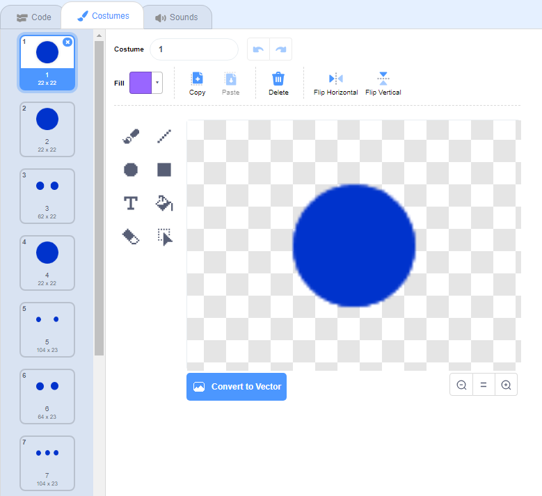

## स्वरों को स्क्रॉल करना

आपको स्वरों को स्टेज को नीचे स्क्रॉल करने की आवश्यकता है ताकि खिलाड़ी को पता चल सके कि कौन सी कुंजियों को दबाया जाए और उन्हें कब दबाया जाए।

\--- task \---

दो सूचियाँ बनाएँ जिसका नामक : `notes`{:class="block3variables"} और `times`{:class="block3variables"}.

[[[generic-scratch3-make-list]]]

\--- /task \---

\--- task \---

निम्नलिखित संख्याओं को अपने में जोड़ें `notes`{:class="block3variables"} और `times`{:class="block3variables"} सूचियों. नोट: सुनिश्चित करें कि **सही क्रम में इन सटीक संख्याओं को जोड़ें**।


\--- /task \---

यहां बताया गया है कि आपके गेम में गाने कैसे संग्रहीत हैं:

+ `notes`{:class="block3variables"} सूची में गाने के स्वरों को (1 से 15 तक), क्रम से संगृहीत किया जाता है।
+ `times`{:class="block3variables"} सूची में उन समयों को संगृहीत किया जाता है जब गाने में स्वरों को बजाया जाना चाहिए।


तो दो नई सूचियों के साथ:

+ स्वर 1 (मध्य C) 5 सेकंड पर बजाया जाना चाहिए
+ स्वर 1 को 5.5 सेकंड पर दुबारा बजाया जाना चाहिए
+ स्वर 3 को 6 सेकंड पर बजाया जाना चाहिए
+ आदि...

\--- task \---

'नोट' स्प्राइट पर क्लिक करें और फिर **show** पर क्लिक करें।


फिर **Costumes** पर क्लिक करें।



\--- /task \---

आपको देखना चाहिए कि 'नोट' स्प्राइट में 15 अलग-अलग पोशाक हैं, प्रत्येक 1 से 15 तक के प्रत्येक अलग नोट के लिए।

\--- task \---

`notes`{:class="block3variables"} में संग्रहीत प्रत्येक नोट के लिए 'नोट' स्प्राइट क्लोन बनाने के लिए कोड जोड़ें। प्रत्येक क्लोन को `times`{:class="block3variables"} में संग्रहीत सही समय पर बनाया जाना चाहिए। प्रत्येक क्लोन को उसके नोट चलाने की आवश्यकता से दो सेकंड पहले बनाया जाना चाहिए। यह क्लोन को स्क्रीन को नीचे ले जाने के लिए दो सेकंड का समय देता है। आप अपने क्लोन को थोड़ा सा स्थानांतरित करने के लिए कोड बनाएंगे!


\--- hints \--- \--- hint \---

 जब `flag is clicked`{:class="block3events"}, 'नोट' स्प्राइट चाहिए `hide`{:class="block3looks"}, और `time`{:class="block3variables"} होना चाहिए `reset`{:class="block3variables"}।

स्क्रिप्ट तब `wait until`{:class="block3control"} का मान `timer`{:class="block3variables"} `greater than`{:class="block3operators"} खेला जाने वाला अगला नोट, जो `time`{:class="block3variables"} सूची के `start of the list`{:class="block3variables"} (`minus 2 seconds`{:class="block3operators"})।

'नोट' स्प्राइट के लिए पोशाक को फिर अगले `note`{:class="block3variables"} पर चलाया जाना चाहिए (`note`{:class="block3variables"} सूची की शुरुआत में), 'नोट' स्प्राइट के एक `clone`{:class="block3events"} से पहले बनाया जाता है।

`notes`{:class="block3variables"} और `times`{:class="block3variables"} सूचियों के प्रारंभ में आइटम तब सूचीबद्ध होने चाहिए `deleted`{:class="block3variables"}, और पूरी प्रक्रिया `repeated until`{:class="block3control"} `notes`{:class="block3variables"} सूची।

\--- /hint \--- \--- hint \---

यहां आपके लिए आवश्यक कोड ब्लॉक हैं:


```blocks3
wait until <>
when flag clicked
length of [notes v]

create clone of (myself v)

reset timer
item (1 v) of [times v]
hide

repeat until <>
end
[] > []
item (1 v) of [notes v]
() - ()
switch costume to ( v)
[] = []
timer
delete (1 v) of [times v]

delete (1 v) of [notes v]
```

\--- /hint \--- \--- hint \---

यह वही है जो आपका कोड दिखना चाहिए:


```blocks3
when flag clicked
reset timer
hide
repeat until <(length of [notes v]) = [0]>
wait until <(timer) > ((item (1 v) of [times v]) - (2))>
switch costume to (item (1 v) of [notes v])
create clone of (myself v)
delete (1 v) of [times v]
delete (1 v) of [notes v]
end
```

\--- /hint \--- \--- /hints \--- \--- /task \---

जब आप अपने कोड का परीक्षण करते हैं, तो ऐसा कुछ भी नहीं होता है, क्योंकि 'नोट' स्प्राइट छिपा हुआ है। यदि आप स्प्राइट दिखाते हैं (या छिपाते नहीं हैं), तो आपको एक दूसरे के शीर्ष पर क्लोन बनाए जाने चाहिए।

\--- task \---

हटाए जाने से पहले प्रत्येक 'नोट' क्लोन को ऊपर से नीचे तक स्टेज के नीचे बनाने के लिए कोड जोड़ें।


```blocks3
when I start as a clone
go to x: (20) y: (160)
show
glide (2) secs to x: (20) y:(-130)
delete this clone
```

\--- /task \---