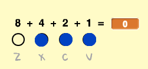

## स्वरों को स्क्रॉल करना

आपको स्वरों को स्टेज को नीचे स्क्रॉल करने की आवश्यकता है ताकि खिलाड़ी को पता चल सके कि कौन सी कुंजियों को दबाया जाए और उन्हें कब दबाया जाए।

\--- task \--- `notes`{:class="block3variables"} और `times`{:class="block3variables"} नामक दो सूचियाँ बनाएँ।

[[[generic-scratch3-make-list]]] \--- /task \---

\--- task \--- अपनी `notes`{:class="block3variables"} और `times`{:class="block3variables"} सूचियों में निम्नलिखित स्वर जोड़ें। टिप्पणी: **इन सही स्वरों को सही क्रम में जोड़ना** सुनिश्चित करें।

 \--- /task \---

यहाँ बताया गया है कि आपके गेम में गाने कैसे संगृहीत किए जाते हैं:

+ `notes`{:class="block3variables"} सूची में गाने के स्वरों को (1 से 15 तक), क्रम से संगृहीत किया जाता है।
+ `times`{:class="block3variables"} सूची में उन समयों को संगृहीत किया जाता है जब गाने में स्वरों को बजाया जाना चाहिए।


तो दो नई सूचियों के साथ:

+ स्वर 1 (मध्य C) 5 सेकंड पर बजाया जाना चाहिए
+ स्वर 1 को 5.5 सेकंड पर दुबारा बजाया जाना चाहिए
+ स्वर 3 को 6 सेकंड पर बजाया जाना चाहिए
+ आदि...

\--- task \--- 'स्वर' स्प्राइट पर क्लिक करें और फिर **show** (दिखाएँ) पर।


फिर **Costumes** (परिधान) पर क्लिक करें।

 \--- /task \---

आप देखेंगे कि 'स्वर' स्प्राइट में 15 अलग-अलग परिधान हैं, 1 से 15 तक के प्रत्येक अलग स्वर के लिए एक।

\--- task \--- `notes`{:class="block3variables"} में संगृहीत प्रत्येक स्वर के लिए एक 'स्वर' स्प्राइट क्लोन बनाने के लिए कोड जोड़ें। प्रत्येक क्लोन `times`{:class="block3variables"} में संगृहीत सही समय पर बनाया जाना चाहिए। प्रत्येक क्लोन उसके स्वर को चलाने की आवश्यकता से दो सेकंड पहले बनाया जाना चाहिए। यह क्लोन को स्क्रीन पर नीचे जाने के लिए दो सेकंड देता है। आप अपने क्लोन को थोड़े से समय में ले जाने के लिए कोड बनाएँगे!



\--- hints \--- \--- hint \---  `flag is clicked`{:class="block3events"} की स्थिति में, 'स्वर' स्प्राइट को `hide`{:class="block3looks"} होना चाहिए, और `timer`{:class="block3variables"} को `reset`{:class="block3variables"} किया जाना चाहिए।

फिर स्क्रिप्ट को `wait until`{:class="block3control"} तब तक प्रतीक्षा करनी चाहिए जब तक `timer`{:class="block3variables"} का मान अगले बजाए जाने वाले स्वर से `greater than`{:class="block3operators"} अधिक न हो, जो सूची के प्रारंभ के समय `time`{:class="block3variables"} से `start of the list`{:class="block3variables"} (`minus 2 seconds`{:class="block3operators"}) कम होगा।

'स्वर' स्प्राइट के लिए परिधान को फिर अगले बजाए जाने वाले स्वर `note`{:class="block3variables"}(the `note`{:class="block3variables"} at the start of the list) पर सेट किया जाना चाहिए, 'note' स्प्राइट का `clone`{:class="block3events"} क्लोन बनाए जाने से पहले।

`notes`{:class="block3variables"} और `times`{:class="block3variables"} सूचियों के आरंभ की आइटमों को `deleted`{:class="block3variables"} हटा देना चाहिए, और पूरी प्रक्रिया को तब तक `repeated until`{:class="block3control"} दोहराया जाना चाहिए जब तक स्वर `notes`{:class="block3variables"} सूची में कोई भी आइटमें बाकी न रह जाएँ।

\--- /hint \--- \--- hint \--- ये वे कोड ब्लॉक हैं जिनकी आपको आवश्यकता है: 

```blocks3
wait until <>
when flag clicked
length of [notes v]

create clone of (myself v)

reset timer
item (1 v) of [times v]
hide

repeat until <>
end
[] > []
item (1 v) of [notes v]
() - ()
switch costume to ( v)
[] = []
timer
delete (1 v) of [times v]

delete (1 v) of [notes v]
```

\--- /hint \--- \--- hint \--- यहाँ दिखाया गया है कि आपका कोड कैसा दिखना चाहिए: 

```blocks3
when flag clicked
reset timer
hide
repeat until <(length of [notes v]) = [0]>
wait until <(timer) > ((item (1 v) of [times v]) - (2))>
switch costume to (item (1 v) of [notes v])
create clone of (myself v)
delete (1 v) of [times v]
delete (1 v) of [notes v]
end
```

\--- /hint \--- \--- /hints \--- \--- /task \---

अब जब आप अपने कोड का परीक्षण करते हैं, तो कुछ भी नहीं होता है, क्योंकि 'स्वर' स्प्राइट छिपा हुआ है। यदि आप स्प्राइट को दिखाते हैं (या छिपाते नहीं हैं), तो आपको एक-दूसरे के ऊपर क्लोन बनते हुए दिखाई देने चाहिए।

\--- task \--- हटाए जाने से पहले प्रत्येक 'स्वर' क्लोन को स्टेज के ऊपर से लेकर नीचे तक ग्लाइड करने के लिए कोड जोड़ें। 

```blocks3
when I start as a clone
go to x: (20) y: (160)
show
glide (2) secs to x: (20) y:(-130)
delete this clone
```

\--- /task \---