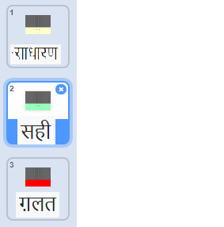

## स्कोर रखें

सही स्वर बजाने के लिए खिलाड़ी को अंक देकर अपने गेम में सुधार करें।

\--- task \--- `score`{:class="block3variables"} नामक एक नया वेरिएबल बनाएँ, और इसे अपने स्टेज के शीर्ष पर रखें।

 \--- /task \---

\--- task \--- जब भी खिलाड़ी सही समय पर सही स्वर बजाता है तो `score`{:class="block3variables"} स्कोर में जोड़ें। गेम के आरंभ में `score`{:class="block3variables"} को `0`{:class="block3variables"} पर सेट करना याद रखें।

\--- hints \--- \--- hint \--- प्रत्येक क्लोन को हटाने से पहले `Before each clone is deleted`{:class="block3control"}, इसे यह देखने के लिए जाँच करनी चाहिए कि `if`{:class="block3control"} यदि स्वर `note`{:class="block3variables"} परिधान की `equal to`{:class="block3operators"} संख्या के समान है `costume number`{:class="block3looks"}, तो उस स्थिति में, स्कोर को `changed`{:class="block3variables"} बदल दिया जाना चाहिए। \--- /hint \--- \--- hint \--- ये वे कोड ब्लॉक हैं जिनकी आपको आवश्यकता है: 

```blocks3
[ ] = [ ]
(costume [number v])
(note)
change [score v] by (1)

if <> then
else
end
```

\--- /hint \--- \--- hint \--- यहाँ दिखाया गया है कि आपका कोड कैसा दिखना चाहिए: 

```blocks3
when I start as a clone
go to x: (20) y: (160)
show
glide (2) secs to x: (20) y:(-130)
+if <(note :: variables) = (costume [number v])> then
change [score v] by (1)
end
delete this clone
```

\--- /hint \--- \--- /hints \--- \--- /task \---

\--- task \--- सही स्वर बजाए जाने पर 'सही' नामक संदेश प्रसारित करें। 

```blocks3
when I start as a clone
go to x: (20) y: (160)
show
glide (2) secs to x: (20) y:(-130)
if <(note :: variables) = (costume [number v])> then
change [score v] by (1)
+broadcast (correct v)
end
delete this clone
```

\--- /task \---

\--- task \--- 

खिलाड़ी जब सही स्वर बजाए तो थोड़े समय के लिए पृष्ठभूमि को बदलने के लिए अपने स्टेज में कोड जोड़ें। इस प्रोजेक्ट में इसके लिए पहले से ही एक दूसरी पृष्ठभूमि शामिल है।


```blocks3
when flag clicked
switch backdrop to (normal v)

when I receive [correct v]
switch backdrop to (correct v)
wait (0.3) seconds
switch backdrop to (normal v)
```

\--- /task \---