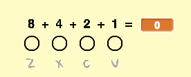

## Binaire getallen

Je gebruikt verschillende combinaties van het indrukken van de vier toetsen om verschillende noten te spelen. Elk van de toetsen is aan (ingedrukt) of uit (niet ingedrukt). Dit betekent dat je elke combinatie van toetsen kunt beschouwen als een **binair getal**.

Als je van rechts naar links beweegt verdubbelen de toetsen in waarde: `1`, `2`, `4`en `8`. Door de getallen boven de ingedrukte toetsen op te tellen, kunt je de waarde van de noot berekenen.


Er zijn 2<sup>4</sup> = **16 combinaties** van het indrukken van de vier toetsen. Dit betekent dat je 15 verschillende noten kunt spelen, omdat `0` betekent dat er geen noot wordt gespeeld.

--- task ---

Maak een nieuwe variabele met de naam `noot`{:class="block3variables"} en sleep deze naast de vier noten sprites.



[[[generic-scratch3-add-variable]]]

--- /task ---

`noot`{:class="block3variables"} slaat de waarde op van de noot die moet worden gespeeld.

--- task ---

Voeg code toe aan het speelveld om de combinatie van ingedrukte toetsen te gebruiken om de waarde van `noot`{:class="block3variables"} te berekenen.

Wanneer bijvoorbeeld `c` en `v` wordt ingedrukt, moet de waarde van `noot`{:class="block3variables"} `3` zijn.


--- hints ---
 --- hint ---


Wanneer op de groene vlag `wordt geklikt`{:class="block3events"}, moet de variabele `noot`{:class="block3variables"} `0`{:class="block3variables"} `gemaakt worden`{:class="block3variables"}.

+ `als`{:class="block3control"} de `v-toets wordt ingedrukt`{:class="block3sensing"}, moet de `noot`{:class="block3variables"} `veranderd worden met 1`{:class="block3variables"}
+ `als`{:class="block3control"} de `c-toets wordt ingedrukt`{:class="block3sensing"}, moet de `noot`{:class="block3variables"} `veranderd worden met 2`{:class="block3variables"}
+ `als`{:class="block3control"} de `x-toets wordt ingedrukt`{:class="block3sensing"}, moet de `noot`{:class="block3variables"} `gewijzigd door 4`{:class="block3variables"}
+ `als`{:class="block3control"} de `z-toets wordt ingedrukt`{:class="block3sensing"}, de `noot`{:class="block3variables"} moet `veranderd worden met 8`{:class="block3variables"}

Al deze code moet `altijd worden herhaald`{:class="block3control"}.

--- /hint --- --- hint ---

Hier zijn de codeblokken die je nodig hebt en je moet er enkele meerdere keren gebruiken:


```blocks3
forever
end

if < > then
end

key ( v) pressed?

change [noot v] by ( )

set [noot v] to [ ]

when flag clicked
```

--- /hint --- --- hint ---

Dit is hoe je code eruit zou moeten zien:


```blocks3
when flag clicked
forever
set [noot v] to [0]
if <key (v v) pressed? > then
change [noot v] by (1)
end
if <key (c v) pressed? > then
change [noot v] by (2)
end
if <key (x v) pressed? > then
change [noot v] by (4)
end
if <key (z v) pressed? > then
change [noot v] by (8)
end
end
```

--- /hint ------ /hints --- --- /task ---