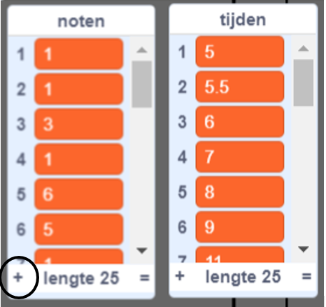
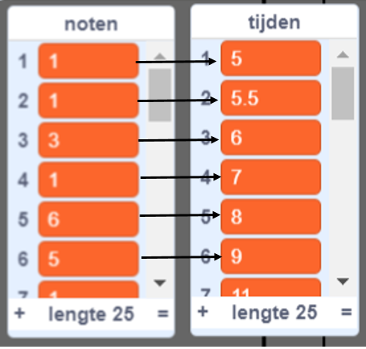
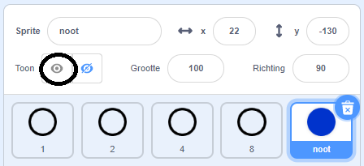
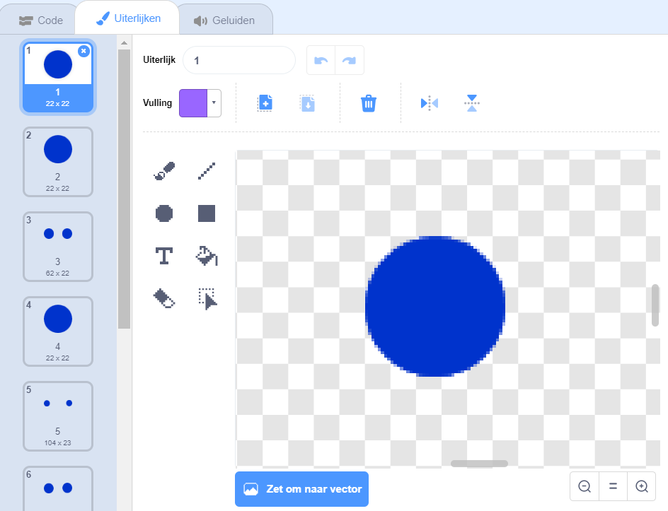

## Scrollende noten

Je moet noten in het speelveld maken zodat de speler weet welke toetsen hij moet indrukken en wanneer hij erop moet drukken.

--- task ---

Maak twee lijsten met de naam `noten`{:class="block3variables"} en `tijden`{:class="block3variables"}.

[[[generic-scratch3-make-list]]]

--- /task ---

--- task ---

Voeg de volgende getallen toe aan de `noten`{:class="block3variables"} en `tijden`{:class="block3variables"} lijsten. Opmerking: zorg ervoor dat **exact deze getallen in de juiste volgorde** worden toegevoegd.



--- /task ---

Hier zie je hoe getallen in je game worden opgeslagen:

+ In de lijst `noten`{:class="block3variables"} worden de noten van het lied (van 1 tot 15) in volgorde opgeslagen
+ De lijst `tijden`{:class="block3variables"} slaat de tijden op waarop de noten in het nummer moeten worden gespeeld



Dus met de twee nieuwe lijsten:

+ Noot 1 (middelste C) moet op 5 seconden worden gespeeld
+ Noot 1 moet opnieuw worden gespeeld op 5,5 seconden
+ Noot 3 moet op 6 seconden worden gespeeld
+ enz...

--- task ---

Klik op de 'noot' sprite en klik vervolgens op **verschijn**.



Klik vervolgens op **Uiterlijken**.



--- /task ---

Je zou moeten zien dat de 'noot' sprite 15 verschillende uiterlijken heeft, één voor elke verschillende noot van 1 tot 15.

--- task ---

Voeg code toe om een 'noot' sprite kloon te maken voor elke noot die is opgeslagen in `noten`{:class="block3variables"}. Elke kloon moet op het juiste tijdstip worden gemaakt, opgeslagen in `tijden`{:class="block3variables"}. Elke kloon moet twee seconden worden gemaakt voordat de noot moet worden gespeeld. Dit geeft de kloon twee seconden om in het scherm omlaag te gaan. Je maakt de code om je klonen een klein beetje te verplaatsen!


--- hints ---
 --- hint ---

 
Wanneer op `de groene vlag wordt geklikt`{:class="block3events"}, moet de 'noot' sprite `verdwijnen`{:class="block3looks"} en moet de `klok`{:class="block3variables"} `gereset`{:class="block3variables"} worden.

Het script moet dan `wachten tot`{:class="block3control"} de waarde van `klok`{:class="block3variables"} `groter is dan`{:class="block3operators"} de volgende te spelen noot, die als `tijd`{:class="block3variables"} aan het `begin van de lijst`{:class="block3variables"} staat (`min 2 seconden`{:class="block3operators"}).

Het uiterlijk voor de 'noot'-sprite moet dan worden ingesteld op de volgende `noot`{:class="block3variables"} die moet worden gespeeld (de `noot`{:class="block3variables"} aan het begin van de lijst), voordat een `kloon`{:class="block3events"} van de 'noot' sprite wordt gemaakt.

De items aan het begin van de `noten`{:class="block3variables"} en `tijden`{:class="block3variables"} lijsten moeten dan `verwijderd`{:class="block3variables"} worden en het hele proces moet `herhaald tot`{:class="block3control"} er geen items meer in de `noten`{:class="block3variables"} lijst zitten.

--- /hint --- --- hint ---

Dit zijn de codeblokken die je nodig hebt:


```blocks3
wacht tot <>
wanneer op de groene vlag wordt geklikt
lengte van [noten v]

maak kloon van (mijzelf v)

zet klok op 0
item (1 v) van [tijden v]
verberg

herhaal tot <>
einde
[] > []
item (1 v) van [noten v]
() - ()
verander uiterlijk naar (v)
[] = []
klok
verwijder (1 v) van [tijden v]

verwijder (1 v) van [noten v]
```

--- /hint --- --- hint ---

Dit is hoe je code eruit zou moeten zien:


```blocks3
wanneer op de groene vlag wordt geklikt
zet klok op 0
verdwijn
herhaal tot <(lengte van [noten v]) = [0]>
wacht tot <(klok) > ((item (1 v) van [tijden v]) - (2))>
verander uiterlijk naar (item (1 v) van [noten v])
maak een kloon van (mijzelf v)
verwijder (1 v) van [tijden v]
verwijder (1 v) van [noten v]
einde
```

--- /hint ------ /hints --- --- /task ---

Wanneer je de code nu test, lijkt er niets te gebeuren, omdat de 'noot' sprite is verborgen. Als je de sprite toont (of niet verbergt), zou je moeten zien dat klonen boven elkaar worden gemaakt.

--- task ---

Voeg code toe om elke 'noot' kloon van boven naar beneden in het speelveld te laten glijden voordat deze wordt verwijderd.


```blocks3
wanneer ik als kloon start
ga naar x: (20) y: (160)
verschijn
schuif in (2) sec. naar x: (20) y: (- 130)
verwijder deze kloon
```

--- /task ---