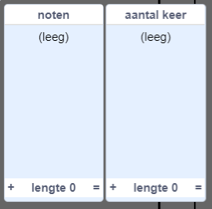
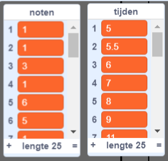

## Bewaar je liedje

Op dit moment worden noten uit de lijsten verwijderd nadat ze zijn gespeeld, je lijsten zijn nu dus leeg:



Je gaat nu code toevoegen om liedjes in je project op te slaan, zodat je niet elke keer de lijsten hoeft te vullen.


\--- task \---

Maak een nieuw blok met de naam `laad 'happy birthday'`{:class="block3myblocks"} dat zowel de `noten`{:class="block3variables"} als `tijden`{:class="block3variables"} lijsten wist en vervolgens de juiste getallen aan beide lijsten toevoegt. [[[generic-scratch3-make-block]]]

\--- hints \--- \--- hint \---

Het `laad 'happy birthday'`{:class="block3myblocks"} blok moet `alle`{:class="block3variables"} items verwijderen uit zowel de `noten`{:class="block3variables"} als de `tijden`{:class="block3variables"} lijsten en vervolgens de juiste zes nummers aan de lijst `toevoegen`{:class="block3variables"} waar ze in horen, in de juiste volgorde.

\--- /hint \--- \--- hint \---

Dit zijn de codeblokken die je nodig hebt:


```blocks3
delete all of [notes v]

define load 'happy birthday'

add [1] to [notes v]

delete all of [times v]
```

\--- /hint \--- \--- hint \---

Dit is hoe je code eruit zou moeten zien:


```blocks3
define load 'happy birthday'
delete all of [notes v]
delete all of [times v]
add [1] to [notes v]
add [5] to [times v]
add [1] to [notes v]
add [5.5] to [times v]
add [3] to [notes v]
add [6] to [times v]
add [1] to [notes v]
add [7] to [times v]
add [6] to [notes v]
add [8] to [times v]
add [5] to [notes v]
add [9] to [times v]
```

\--- /hint \--- \--- /hints \--- \--- /task \---

\--- task \---

Test je nieuwe blok door het aan het begin van je project uit te voeren.


```blocks3
wanneer op de groene vlag wordt geklikt
+ laad 'happy birthday' ::custom
verdwijn
zet klok op 0
```

Elk van je lijsten zou nu zes getallen moeten bevatten.



\--- /task \---