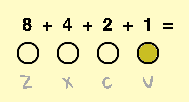

## Naciśnięcia klawiszy

Ile nut możesz grać czterema klawiszami? To może być więcej niż myślisz!

\--- zadanie \--- Otwórz projekt startowy Scratch „Binary hero”.

**Online:** otwórz nowy projekt Scratcha na stronie [rpf.io/binary-hero-on](http://rpf.io/binary-hero-on){:target="_blank"}. Jeżeli masz już konto Scratch, możesz kliknąć **Remiz** w prawym-górnym rogu, aby zapisać kopię projektu.

**Offline:** otwórz [projekt startowy](http://rpf.io/p/en/binary-hero-go){: target = "_ blank"} w edytorze offline. Jeśli musisz pobrać i zainstalować edytor Scratcha, znajdziesz go na stronie [rpf.io/scratchoff](http://rpf.io/scratchoff){:target="_blank"}. \--- /task \---

Zacznij od pokazania, który klawisz jest naciskany.

\--- zadanie \--- Kliknij duszka o nazwie „1” i dodaj kod, aby zmienić kostium duszka po naciśnięciu klawisza ``.


```blocks3
kiedy flaga kliknęła
zawsze
jeśli wciśnięto < klawisze (vv)?> następnie
przełącz kostium na (on v)
else
przełącz kostium na (off v)
koniec
```

Podczas testowania kodu przez naciśnięcie klawisza <kbd>v</kbd> , duszek powinien się zaświecić.

 \--- /task \---

\--- zadanie \--- Zrób to samo dla pozostałych trzech duszków, aby zapalały się po naciśnięciu klawiszy <kbd>z</kbd>, <kbd>x</kbd>lub <kbd>c</kbd>.

 \--- /task \---