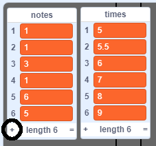
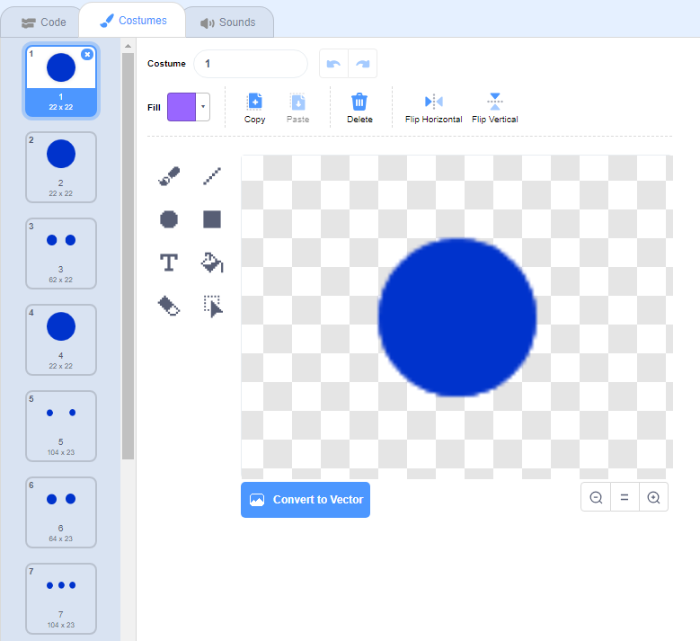

## Przewijanie notatek

Musisz robić notatki, przewijając w dół stołu montażowego, aby gracz wiedział, które klawisze należy nacisnąć i kiedy je nacisnąć.

\--- task \---

Create two lists called `notes`{:class="block3variables"} and `times`{:class="block3variables"}.

[[[generic-scratch3-make-list]]]

\--- /task \---

\--- task \---

Add the following numbers to your `notes`{:class="block3variables"} and `times`{:class="block3variables"} lists. Note: make sure to **add these exact numbers in the right order**.



\--- /task \---

Here's how songs are stored in your game:

+ Lista `nut`{: class = "block3variables"} przechowuje nuty utworu (od 1 do 15), w kolejności
+ Lista `razy`{: class = "block3variables"} przechowuje czasy, w których nuty powinny być odtwarzane w utworze


So with the two new lists:

+ Uwaga 1 (środkowe C) powinna być odtwarzana po 5 sekundach
+ Uwaga 1 powinna zostać odtworzona ponownie po 5,5 sekundy
+ Uwaga 3 powinna być odtwarzana po 6 sekundach
+ itp...

\--- task \---

Click on the 'note' sprite and then click on **show**.


Then click on **Costumes**.



\--- /task \---

You should see that the 'note' sprite has 15 different costume, one for each different note from 1 to 15.

\--- task \---

Add code to create a 'note' sprite clone for every note stored in `notes`{:class="block3variables"}. Each clone should be created at the correct time stored in `times`{:class="block3variables"}. Each clone should be created two seconds before its note needs to be played. This gives the clone two seconds to move down the screen. You'll create the code to move your clones in a little bit!


\--- hints \--- \--- hint \---

 When the `flag is clicked`{:class="block3events"}, the 'note' sprite should `hide`{:class="block3looks"}, and the `timer`{:class="block3variables"} should be `reset`{:class="block3variables"}.

The script should then `wait until`{:class="block3control"} the value of `timer`{:class="block3variables"} is `greater than`{:class="block3operators"} the next note to be played, which will be the `time`{:class="block3variables"} at the `start of the list`{:class="block3variables"} (`minus 2 seconds`{:class="block3operators"}).

The costume for the 'note' sprite should then be set to the next `note`{:class="block3variables"} to be played (the `note`{:class="block3variables"} at the start of the list), before a `clone`{:class="block3events"} of the 'note' sprite is created.

The items at the start of the `notes`{:class="block3variables"} and `times`{:class="block3variables"} lists should then be `deleted`{:class="block3variables"}, and the entire process should be `repeated until`{:class="block3control"} there are no items left in the `notes`{:class="block3variables"} list.

\--- /hint \--- \--- hint \---

Here are the code blocks you need:


```blocks3
poczekaj aż <>
po kliknięciu flagi
długość [uwagi v]

stwórz klon (siebie v)

zresetuj licznik
pozycji (1 v) z [razy v]
ukryj

powtórz do <>
koniec
[] > []
pozycja (1 v) z [uwagi v]
() - ()
zmień kostium na (v)
[] = []
timer
usuń (1 v) z [razy v]

usuń (1 v ) z [uwagi v]
```

\--- /hint \--- \--- hint \---

This is what your code should look like:


```blocks3
po kliknięciu flagi
zresetuj licznik
ukryj
powtórz do <(długość [uwagi v]) = [0]>
poczekaj do <(licznik) > ((pozycja (1 v) z [razy v]) - (2))>
zmień kostium na (pozycja (1 v) z [uwagi v])
stwórz klon (siebie v)
usuń (1 v) z [razy v]
usuń (1 v) z [uwagi v]
koniec
```

\--- /hint \--- \--- /hints \--- \--- /task \---

When you test your code now, nothing seems to happen, because the 'note' sprite is hidden. If you show (or don't hide) the sprite, then you should see clones being created on top of each other.

\--- task \---

Add code to make each 'note' clone glide from the top to the bottom of the Stage before being deleted.


```blocks3
kiedy zaczynam jako klon
przejdź do x: (20) y: (160)
pokaż
szybowanie (2) sek do x: (20) y: (- 130)
usuń ten klon
```

\--- /task \---