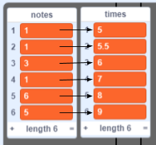
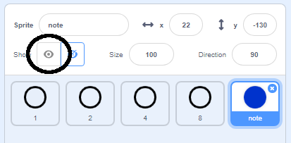

## Przewijanie notatek

Musisz robić notatki, przewijając w dół stołu montażowego, aby gracz wiedział, które klawisze należy nacisnąć i kiedy je nacisnąć.

\--- zadanie \--- Utwórz dwie listy o nazwie `notatki`{: class = "block3variables"} i `razy`{: class = "block3variables"}.

[[[generic-scratch3-make-list]]] \--- / zadanie \---

\--- zadanie \--- Dodaj następujące liczby do `notatek`{: class = "block3variables"} i `razy`{: class = "block3variables"}. Uwaga: pamiętaj, aby **dodać te dokładne liczby we właściwej kolejności**.

 \--- /task \---

Oto, jak utwory są przechowywane w Twojej grze:

+ Lista `nut`{: class = "block3variables"} przechowuje nuty utworu (od 1 do 15), w kolejności
+ Lista `razy`{: class = "block3variables"} przechowuje czasy, w których nuty powinny być odtwarzane w utworze



Tak więc z dwiema nowymi listami:

+ Uwaga 1 (środkowe C) powinna być odtwarzana po 5 sekundach
+ Uwaga 1 powinna zostać odtworzona ponownie po 5,5 sekundy
+ Uwaga 3 powinna być odtwarzana po 6 sekundach
+ itp...

\--- zadanie \--- Kliknij ikonę „Uwaga”, a następnie kliknij **pokaż**.



Następnie kliknij **Kostiumy**.

 \--- /task \---

Powinieneś zobaczyć, że duszek „nuty” ma 15 różnych kostiumów, po jednym dla każdej nuty od 1 do 15.

\--- zadanie \--- Dodaj kod, aby utworzyć klon duszka „notatka” dla każdej nuty przechowywanej w `notatce`{: class = "block3variables"}. Każdy klon powinien zostać utworzony we właściwym czasie przechowywanym w `razy`{: class = "block3variables"}. Każdy klon powinien zostać utworzony dwie sekundy przed odtworzeniem nuty. To daje klonowi dwie sekundy na przejście w dół ekranu. Stworzysz kod, aby trochę przenieść swoje klony!


\--- wskazówki \--- \--- wskazówka \---  Po kliknięciu flagi ``{: class = "block3events"}, ikonka "note" powinna `ukryć`{: class = "block3looks" }, a `timer`{: class = "block3variables"} powinien mieć wartość `reset`{: class = "block3variables"}.

Skrypt powinien następnie `czekać, aż`{: class = "block3control"} wartość `timera`{: class = "block3variables"} będzie `większa niż`{: class = "block3operators"} następna nuta do odtworzenia, który będzie `czasem`{: class = "block3variables"} na początku `listy`{: class = "block3variables"} (`minus 2 sekundy`{: class = "block3operators"}).

Kostium dla duszka „nutowego” należy następnie ustawić na następną `nutę`{: class = "block3variables"}, która ma być odtwarzana ( `nuty`{: class = "block3variables"} na początku listy), przed utworzeniem `klonów`{: class = "block3events"} duszka 'note'.

Pozycje na początku `uwag`{: class = "block3variables"} i `razy`{: class = "block3variables"} należy następnie usunąć ``{: class = "block3variables"}, a cały proces należy powtórzyć `aż do`{: class = "block3control"} nie ma żadnych pozycji na liście `uwag`{: class = "block3variables"}.

\--- /hint \--- \--- hint \--- Oto potrzebne bloki kodu: 

```blocks3
poczekaj aż <>
po kliknięciu flagi
długość [uwagi v]

stwórz klon (siebie v)

zresetuj licznik
pozycji (1 v) z [razy v]
ukryj

powtórz do <>
koniec
[] > []
pozycja (1 v) z [uwagi v]
() - ()
zmień kostium na (v)
[] = []
timer
usuń (1 v) z [razy v]

usuń (1 v ) z [uwagi v]
```

\--- /hint \--- \--- hint \--- Twój kod powinien wyglądać tak: 

```blocks3
po kliknięciu flagi
zresetuj licznik
ukryj
powtórz do <(długość [uwagi v]) = [0]>
poczekaj do <(licznik) > ((pozycja (1 v) z [razy v]) - (2))>
zmień kostium na (pozycja (1 v) z [uwagi v])
stwórz klon (siebie v)
usuń (1 v) z [razy v]
usuń (1 v) z [uwagi v]
koniec
```

\--- /hint \--- \--- /hints \--- \--- /task \---

Kiedy testujesz teraz swój kod, wydaje się, że nic się nie dzieje, ponieważ duszek „note” jest ukryty. Jeśli pokażesz (lub nie ukryjesz) duszka, powinieneś zobaczyć klony tworzone jeden na drugim.

\--- zadanie \--- Dodaj kod, aby każdy klon „notatki” przesuwał się od góry do dołu stołu montażowego przed usunięciem. 

```blocks3
kiedy zaczynam jako klon
przejdź do x: (20) y: (160)
pokaż
szybowanie (2) sek do x: (20) y: (- 130)
usuń ten klon
```

\--- /task \---