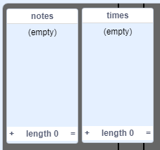

## Przechowuj swoją piosenkę

W tej chwili notatki są usuwane z list po odtworzeniu, więc masz puste listy:



Teraz dodasz kod do przechowywania piosenek w swoim projekcie, abyś nie musiał za każdym razem dodawać do list.


\--- task \---

Make a new block called `load 'happy birthday'`{:class="block3myblocks"} that clears both the `notes`{:class="block3variables"} and `times`{:class="block3variables"} lists, and then adds the correct numbers back into both lists. [[[generic-scratch3-make-block]]]

\--- hints \--- \--- hint \---

The `load 'happy birthday'`{:class="block3myblocks"} block should `delete all`{:class="block3variables"} items from both the `notes`{:class="block3variables"} and `times`{:class="block3variables"} lists and then `add`{:class="block3variables"} the correct six numbers to the list they belong in, in the correct order.

\--- /hint \--- \--- hint \---

Here are the code blocks you need:


```blocks3
usuń (wszystkie v) z [notatek v]

zdefiniuj ładuj „wszystkiego najlepszego”

dodaj [1] do [notatek v]

usuń (wszystkie v) z [czasów v]
```

\--- /hint \--- \--- hint \---

This is what your code should look like:


```blocks3
zdefiniuj ładowanie „wszystkiego najlepszego”
usuń (wszystkie v) z [notatek v]
usuń (wszystkie v) z [razy v]
dodaj [1] do [notatek v]
dodaj [5] do [razy v]
dodaj [1] do [notatek v]
dodaj [5.5] do [razy v]
dodaj [3] do [notatek v]
dodaj [6] do [razy v]
dodaj [1] do [notatek v]
dodaj [7] do [razy v]
dodaj [6] do [notatek v]
dodaj [8] do [razy v]
dodaj [5] do [notatek v]
dodaj [9] do [razy v]
```

\--- /hint \--- \--- /hints \--- \--- /task \---

\--- task \---

Test your new block by running it at the start of your project.


```blocks3
po kliknięciu flagi
+ załaduj „wszystkiego najlepszego” :: niestandardowe
ukryj
zeruj licznik czasu
```

Each of your lists should now contain six numbers.


\--- /task \---