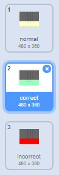

## Zachowaj wynik

Popraw swoją grę, przyznając graczom punkty za zagranie właściwej nuty.

\--- task \---

Create a new variable called `score`{:class="block3variables"}, and place it at the top of your Stage.


\--- /task \---

\--- task \---

Add to `score`{:class="block3variables"} whenever the player plays the correct note at the correct time. Remember to set `score`{:class="block3variables"} to `0`{:class="block3variables"} at the start of the game.

\--- hints \--- \--- hint \---

`Before each clone is deleted`{:class="block3control"}, it should check to see `if`{:class="block3control"} the `note`{:class="block3variables"} is `equal to`{:class="block3operators"} the `costume number`{:class="block3looks"}, and in that case, the score should be `changed`{:class="block3variables"}.

\--- /hint \--- \--- hint \---

Here are the code blocks you need:


```blocks3
[] = []
(kostium [liczba v])
(uwaga)
zmień [wynik v] o (1)

jeśli <> to

kończy
```

\--- /hint \--- \--- hint \---

This is what your code should look like:


```blocks3
kiedy zaczynam jako klon
przejdź do x: (20) y: (160)
pokaż
szybowanie (2) s do x: (20) y: (- 130)
+ if <(uwaga :: zmienne) = (kostium [numer v])> a następnie
zmień [wynik v] o (1)

usuń ten klon
```

\--- /hint \--- \--- /hints \--- \--- /task \---

\--- task \---

Broadcast a message called 'correct' when the correct note is played.


```blocks3
kiedy zaczynam jako klon
przejdź do x: (20) y: (160)
pokaż
szybowanie (2) sek. do x: (20) y: (- 130)
jeśli <(uwaga :: zmienne) = ( kostium [numer v])> a następnie
zmień [wynik v] o (1)
+ transmisja (poprawne v)
koniec
usuń ten klon
```

\--- /task \---

\--- task \---



Add code to your Stage to briefly change the backdrop when the player plays the correct note. The project already contains a second backdrop for this.


```blocks3
po kliknięciu flagi
przełącz tło na (normalne v)

gdy otrzymam [poprawne v]
przełącz tło na (prawidłowe v)
poczekaj (0,3) sekundy
przełącz tło na (normalne v)
```

\--- /task \---