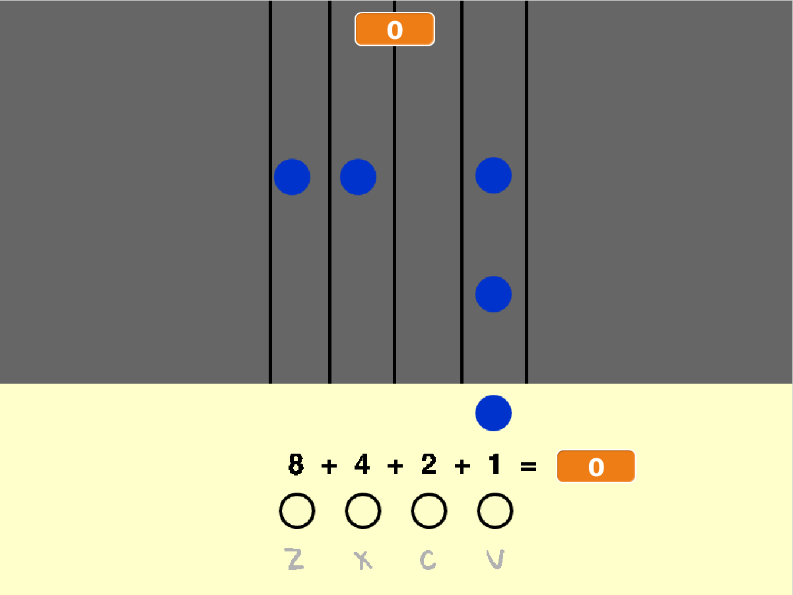

--- no-print ---

Это версия проекта для **Scratch 3**. Есть также [версия для Scratch 2](https://projects.raspberrypi.org/ru-RU/projects/binary-hero-scratch2).

--- /no-print ---

## Введение

В этом проекте ты создашь игру, в которой будешь проигрывать ноты песни, когда они будут появляться на Сцене.

### Что тебе нужно будет сделать

--- no-print ---

Нажми на зеленый флаг, чтобы начать игру. Используй клавиши <kbd>z</kbd>, <kbd>x</kbd>, <kbd>c</kbd>, и <kbd>v</kbd> чтобы проиграть правильные ноты когда они достигнут нижней части Сцены. Каждая правильно сыгранная нота даст тебе 10 очков.

  <iframe allowtransparency="true" width="485" height="402" src="https://scratch.mit.edu/projects/embed/259028053/?autostart=false" frameborder="0" scrolling="no"></iframe>

--- /no-print ---

--- print-only ---

Ноты будут падать сверху и тебе нужно нажимать клавиши, чтобы «поймать» и сыграть их. 

--- /print-only ---

--- collapse ---
---
title: Чему ты научишься
---

+ Как использовать списки для хранения последовательностей нот и таймингов
+ Как использовать пользовательские блоки с введенными данными

--- /collapse ---

--- collapse ---
---
title: Что тебе понадобится
---

### Оборудование

+ Компьютер, способный запускать Scratch 3

### Программное обеспечение

+ Scratch 3 (либо [онлайн-редактор](http://rpf.io/scratchon){:target="_blank"}, либо [автономный редактор (без подключения к Интернету)](http://rpf.io/scratchoff){:target="_blank"})

### Загрузки

+ [Автономный стартовый проект](http://rpf.io/p/ru-RU/binary-hero-go){:target="_blank"}

--- /collapse ---

--- collapse ---
---
title: Дополнительные примечания для педагогов
---

--- no-print ---

Если ты хочешь распечатать этот проект, то воспользуйся [версией для печати](https://projects.raspberrypi.org/ru-RU/projects/binary-hero/print).

--- /no-print ---

Здесь ты можешь найти [завершённый проект](http://rpf.io/p/ru-RU/binary-hero-get){:target="_blank"}.

--- /collapse ---