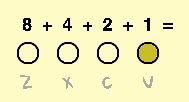

## Использование клавиш

Сколько нот можно сыграть четырьмя клавишами? Даже больше, чем ты можешь представить!

\--- task \---

Открой стартовый проект "Двоичный герой".

**Online:** open the starter project at [rpf.io/binary-hero-on](https://rpf.io/binary-hero-on){:target="_blank"}. Если у тебя есть аккаунт в Scratch, ты можешь нажать на **Ремикс** в правом верхнем углу, чтобы сохранить копию проекта.

**Offline:** open the [starter project](https://rpf.io/p/en/binary-hero-go){:target="_blank"}in the offline editor. If you need to download and install the Scratch offline editor, you can find it at [rpf.io/scratchoff](https://rpf.io/scratchoff){:target="_blank"}.

\--- /task \---

Начни с того, что покажи, какая клавиша нажата.

\--- task \---

Нажми на спрайт с именем '1' и добавь код, чтобы изменить костюм спрайта, когда нажата клавиша `v`.


```blocks3
when flag clicked
forever
if < key (v v) pressed?> then
switch costume to (on v)
else
switch costume to (off v)
end
```

Когда проверяешь код, нажимая на клавишу <kbd>v</kbd>, спрайт должен подсвечиваться.



\--- /task \---

\--- task \---

Сделай то же самое для остальных трех спрайтов, чтобы они подсвечивались при нажатии клавиш <kbd>z</kbd>, <kbd>х</kbd> или <kbd>с</kbd>.


\--- /task \---