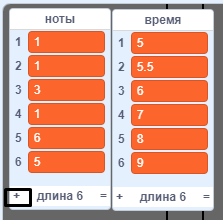
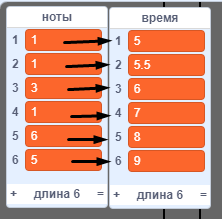
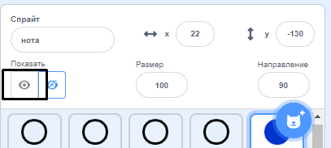
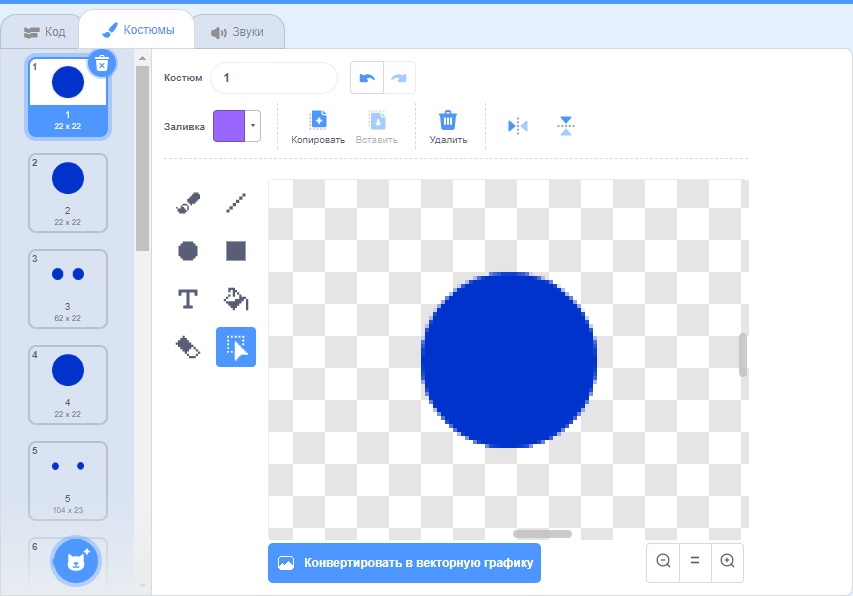

## Прокрутка нот

Тебе нужно заставить ноты опускаться по сцене вниз, чтобы игрок понимал, какие клавиши и когда нажимать.

\--- task \---

Создай два новых списка с именами `ноты`{:class="block3variables"} и `время`{:class="block3variables"}.

[[[generic-scratch3-make-list]]]

\--- /task \---

\--- task \---

Добавьте следующие числа к спискам `ноты` {:class="block3variables"} и `время`{:class="block3variables"}. Примечание: убедись, что ты ** добавишь эти числа в правильном порядке **.



\--- /task \---

Вот как хранятся песни в твоей игре:

+ Список `ноты`{:class="block3variables"} хранит ноты песни (от 1 до 15) в порядке
+ Список `время`{:class="block3variables"} хранит время, когда ноты должны быть проиграны в песне



Итак, с двумя новыми списками:

+ Нота 1 (середняя С) должна воспроизводиться 5 секунд
+ Нота 1 должна быть воспроизведена снова на 5,5 секунде
+ Нота 3 должна воспроизводиться на 6 секунде
+ и т. д...

\--- task \---

Нажми на спрайт ноты, а затем нажми на **показать**.



Затем нажмите на **Костюмы**.



\--- /task \---

Ты должен увидеть, что у спрайта «нота» 15 разных костюмов, по одному на каждую отдельную ноту от 1 до 15.

\--- task \---

Добавь код, чтобы создать клон спрайта 'нота' для каждой ноты, хранящейся в списке `ноты`{:class="block3variables"}. Каждый клон должен быть создан в правильное время, сохраненное в переменной `время`{:class="block3variables"}. Каждый клон должен быть создан за две секунды до воспроизведения его ноты. Благодаря этому у клона есть две секунды, чтобы спуститься вниз по экрану. Ты создашь код для перемещения клонов!


\--- hints \--- \--- hint \---

 Когда `зелёный флаг нажат`{:class="block3events"}, спрайт 'нота' нужно `скрыть`{:class="block3looks"}, и `таймер`{:class="block3variables"} должен `перезапуститься`{:class="block3variables"}.

Скрипт должен тогда `ждать пока`{:class="block3control"} значение `таймера`{:class="block3variables"} будет `больше, чем`{:class="block3operators"} у следующей воспроизведенной ноты, а это будет `время`{:class="block3variables"} в `начале списка`{:class="block3variables"} (`минус 2 секунды`{:class="block3operators"}).

Костюм для спрайта 'нота' должен быть установлен на воспроизведение следующей `ноты`{:class="block3variables"} (`нота`{:class="block3variables"} из начала списка), до создания ` клона`{:class="block3events"} спрайта 'нота'.

Элементы в начале списков `ноты`{:class="block3variables"} и `время`{:class="block3variables"} должны быть затем `удалены`{:class="block3variables"}, и весь процесс должен `повторяться до`{:class="block3control"} тех пор, пока не останется элементов в списке `ноты`{:class="block3variables"}.

\--- /hint \--- \--- hint \---

Вот блоки кода, которые тебе нужны:


```blocks3
wait until <>
when flag clicked
length of [notes v]

create clone of (myself v)

reset timer
item (1 v) of [times v]
hide

repeat until <>
end
[] > []
item (1 v) of [notes v]
() - ()
switch costume to ( v)
[] = []
timer
delete (1 v) of [times v]

delete (1 v) of [notes v]
```

\--- /hint \--- \--- hint \---

Так должен выглядеть твой код:


```blocks3
when flag clicked
reset timer
hide
repeat until <(length of [notes v]) = [0]>
wait until <(timer) > ((item (1 v) of [times v]) - (2))>
switch costume to (item (1 v) of [notes v])
create clone of (myself v)
delete (1 v) of [times v]
delete (1 v) of [notes v]
end
```

\--- /hint \--- \--- /hints \--- \--- /task \---

Когда ты сейчас протестируешь код, будет казаться, что ничего не происходит, потому, что спрайт «ноты» скрыт. Если ты покажешь (или не скроешь) спрайт, то должен увидеть, как клоны создаются друг на друге.

\--- task \---

Добавь код, чтобы каждый клон «ноты» скользил от верхней части к нижней части сцены перед тем, как удалялся.


```blocks3
when I start as a clone
go to x: (20) y: (160)
show
glide (2) secs to x: (20) y:(-130)
delete this clone
```

\--- /task \---