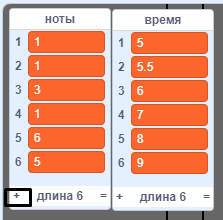

## Сохрани свою песню

На данный момент ноты удаляются из списков после воспроизведения, поэтому остаются пустые списки:


Теперь ты добавишь код для хранения песен, чтобы не приходилось каждый раз добавлять их в списки.



--- task ---

Создай новый блок с именем `загрузить "с днем рожденья"`{:class="block3myblocks"}, который очищает оба списка `ноты`{:class="block3variables"} и `время`{:class="block3variables"}, а затем добавляет правильные числа обратно в оба списка. 

[[[generic-scratch3-make-block]]]

--- hints ---
 --- hint ---

Блок `загрузить "с днем рождения"`{:class="block3myblocks"} должен `удалить все`{:class="block3variables"} элементы из обоих списков `ноты`{:class="block3variables"} и `время`{:class="block3variables"} и затем `добавляет`{:class="block3variables"} правильные шесть чисел в правильном порядке в список, в котором он находится.

--- /hint --- --- hint ---

Вот блоки кода, которые тебе нужны:


```blocks3
delete (all v) of [ноты v]

define загрузить "с днём рождения"

add [1] to [ноты v]

delete (all v) of [время v]
```

--- /hint --- --- hint ---

Так должен выглядеть твой код:


```blocks3
define загрузить "с днём рождения"
delete (all v) of [ноты v]
delete (all v) of [время v]
add [1] to [ноты v]
add [5] to [время v]
add [1] to [ноты v]
add [5.5] to [время v]
add [3] to [ноты v]
add [6] to [время v]
add [1] to [ноты v]
add [7] to [время v]
add [6] to [ноты v]
add [8] to [время v]
add [5] to [ноты v]
add [9] to [время v]
```

--- /hint ------ /hints --- --- /task ---

--- task ---

Проверь новый блок, запустив его в начале проекта.


```blocks3
when flag clicked
+загрузить "с днём рождения" ::custom
hide
reset timer
```

Каждый из списков теперь должен содержать шесть чисел.


--- /task ---