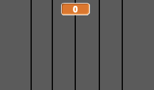
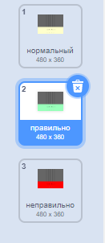

## Веди счет

Улучши игру, дав игрокам очки за правильную ноту.

--- task ---

Создай новую переменную с именем `счет`{:class="block3variables"} и помести её в верхнюю часть Сцены.



--- /task ---

--- task ---

Добавляй `счет`{:class="block3variables"} всякий раз, когда игрок играет правильную ноту в правильное время. Не забудь установить `счет`{:class="block3variables"} в `0`{:class="block3variables"} в начале игры.

--- hints ---
 --- hint ---

`Перед удалением каждого клона`{:class="block3control"}, он должен проверить, `если`{:class="block3control"} `нота`{:class="block3variables"} `равна`{:class="block3operators"} `номеру костюма`{:class="block3looks"}, то тогда счет должен быть `изменен`{:class="block3variables"}.

--- /hint --- --- hint ---

Вот блоки кода, которые тебе нужны:


```blocks3
[ ] = [ ]
(costume [number v])
(нота)
change [счёт v] by (1)

if <> then
else
end
```

--- /hint --- --- hint ---

Вот как должен выглядеть твой код:


```blocks3
when I start as a clone
go to x: (20) y: (160)
show
glide (2) secs to x: (20) y:(-130)
+if <(нота :: variables) = (costume [number v])> then
change [счёт v] by (1)
end
delete this clone
```

--- /hint ------ /hints --- --- /task ---

--- task ---

Передавай сообщение с именем «правильно», когда воспроизводится правильная нота.


```blocks3
when I start as a clone
go to x: (20) y: (160)
show
glide (2) secs to x: (20) y:(-130)
if <(нота :: variables) = (costume [number v])> then
change [счёт v] by (1)
+broadcast (правильно v)
end
delete this clone
```

--- /task ---

--- task ---



Добавь код к Сцене, чтобы ненадолго изменить фон, когда игрок играет правильную ноту. Проект уже содержит второй фон.


```blocks3
когда щёлкнут по зелёному флагу
переключить фон на (нормальный v)

когда я получу [правильно v]
переключить фон на (правильно v)
ждать (0.3) секунд
переключить фон на (правильно v)
```

--- /task ---