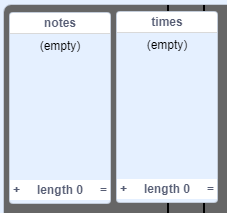
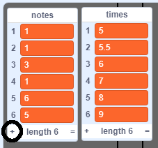

## Store your song

At the moment, notes are removed from the lists after being played, so you're left with empty lists:



You're now going to add code to store songs in your project, so that you don't have to add to your lists each time.



\--- task \--- Make a new block called `load 'happy birthday'`{:class="block3myblocks"} that clears both the `notes`{:class="block3variables"} and `times`{:class="block3variables"} lists, and then adds the correct numbers back into both lists. [[[generic-scratch3-make-block]]] \--- hints \--- \--- hint \--- The `load 'happy birthday'`{:class="block3myblocks"} block should `delete all`{:class="block3variables"} items from both the `notes`{:class="block3variables"} and `times`{:class="block3variables"} lists and then `add`{:class="block3variables"} the correct six numbers to the list they belong in, in the correct order. \--- /hint \--- \--- hint \--- Here are the code blocks you need: 

```blocks3
delete (all v) of [notes v]

define load 'happy birthday'

add [1] to [notes v]

delete (all v) of [times v]
```

\--- /hint \--- \--- hint \--- 你的代码应该像这样：

```blocks3
define load 'happy birthday'
delete (all v) of [notes v]
delete (all v) of [times v]
add [1] to [notes v]
add [5] to [times v]
add [1] to [notes v]
add [5.5] to [times v]
add [3] to [notes v]
add [6] to [times v]
add [1] to [notes v]
add [7] to [times v]
add [6] to [notes v]
add [8] to [times v]
add [5] to [notes v]
add [9] to [times v]
```

\--- /hint \--- \--- /hints \--- \--- /task \---

\--- task \--- Test your new block by running it at the start of your project. 

```blocks3
when flag clicked
+load 'happy birthday' ::custom
hide
reset timer
```

Each of your lists should now contain six numbers.

 \--- /task \---